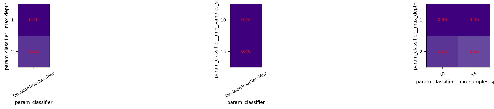
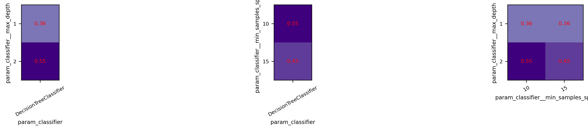
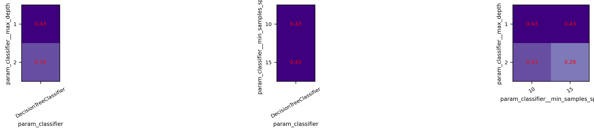
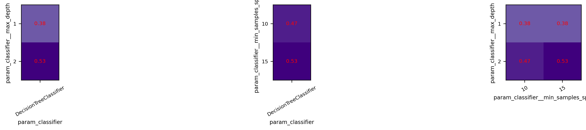
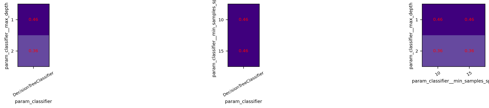
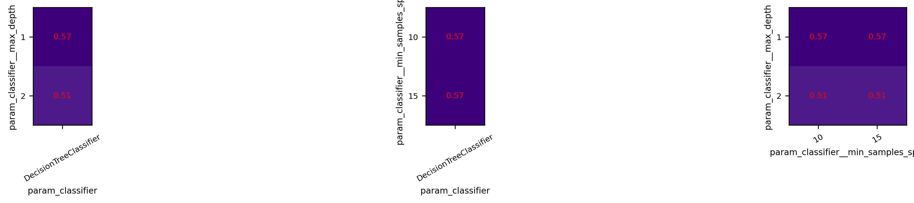
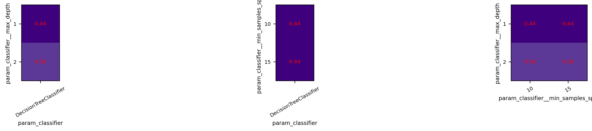
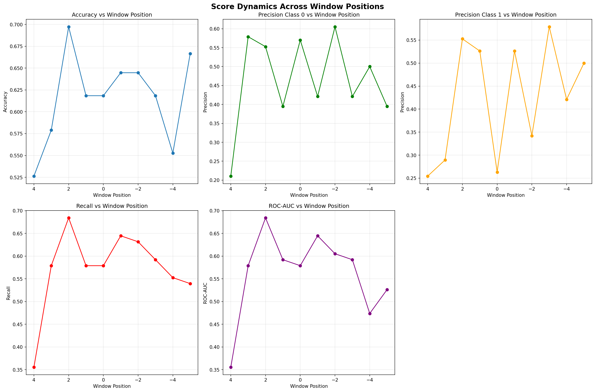

## Анализ разделимости скользящих окон

**Список событий:**

| rat_id | date |
|----------|----------|
| R2 | 2022-11-07 |
| R2 | 2022-11-18 |
| R2 | 2023-04-03 |
| R2 | 2023-04-11 |
| R2 | 2023-04-18 |
| R2 | 2023-04-21 |
| R2 | 2023-05-03 |
| R2 | 2023-05-09 |
| R2 | 2024-09-30 |
| R2 | 2024-10-29 |
| R3 | 2025-01-23 |
| R3 | 2025-03-14 |
| R1 | 2025-07-02 |
| R2 | 2025-07-02 |
| R3 | 2025-07-02 |
| R4 | 2025-07-02 |
| R1 | 2025-07-20 |
| R2 | 2025-07-20 |
| R3 | 2025-07-20 |
| R4 | 2025-07-20 |

**Структура пайплайна:**

```py
Pipeline steps:
  1. label_generator: CustomEventLabelGeneratorYt
  2. rem_calculator: REMProfileCalculatorYt
  3. sample_scaler: MaxMinSampleScaler
  4. feature_extractor: REMDailyMultiStatExtractorYt
  5. classifier: LogisticRegression
```
**Сетка гиперпараметров:**

| Параметр | Возможные значения |
|----------|-------------------|
| rem_calculator → window_size_hours | 2, 3 |
| feature_extractor → daily_statistics | ['max_min_diff', 'mean'], ['max_min_diff'], ['mean'] |
| classifier | DecisionTreeClassifier() |
| classifier → max_depth | 1, 2 |
| classifier → min_samples_split | 9, 10, 12, 14, 15 |


---

## Позиция сдвига относительно события 4 (аномальное окно: дни 6 to 4; контрольное окно: дни 8 to 5)



**Лучшие параметры:**

| Параметр | Значение |
|----------|----------|
| classifier | DecisionTreeClassifier() |
| classifier → max_depth | 2 |
| classifier → min_samples_split | 15 |
| feature_extractor → daily_statistics | ['mean'] |
| rem_calculator → window_size_hours | 3 |

**Результаты кросс-валидации:**

| Метрика | Значение |
|----------|----------|
| Accuracy | 0.5263 ± 0.3023 |
| Precision class 0 | 0.2105 ± 0.3370 |
| Precision class 1 | 0.2544 ± 0.3349 |
| Recall | 0.3553 ± 0.3174 |
| Roc-auc | 0.3553 ± 0.3174 |

```
В данном эксперименте в качестве контрольного (нормального) окна шириной 3 дня используются дни с 9 по 7 до сейсмического события, положение же целевого (аномального) окна в каждом эксперименте сдвигается на сутки вперед: от окна, совпадающего с контрольным, до окна с 6 по 8 день после события.

В кажом отчете представленны результаты 4-fold кросс-валидаци с проекциями пространства гиперпараметров в точке оптимума точности (Accuracy).

В конце отчета находится сводный график метрик разделимости данных подобранных моделей для разных окон со средними и отклонением по 4-м фолдам кросс-валидации.

В качестве признака используется размахи профиля на некотором разбиении вектора быстроволнового сна. Диаметр разбиения, а также ширина и шаг скользаящего окна для вычисления самого вектора являются гиперпараметрами и в каждом эксперементе различаются.

Для классификации используются простейшие модели: Логистическая регрессия и Метод опорных векторов с разными ядрами, решателями и прочими гиперпараметрами.
```


---

## Позиция сдвига относительно события 3 (аномальное окно: дни 5 to 3; контрольное окно: дни 8 to 5)


**Лучшие параметры:**

| Параметр | Значение |
|----------|----------|
| classifier | DecisionTreeClassifier() |
| classifier → max_depth | 1 |
| classifier → min_samples_split | 9 |
| feature_extractor → daily_statistics | ['max_min_diff', 'mean'] |
| rem_calculator → window_size_hours | 2 |

**Результаты кросс-валидации:**

| Метрика | Значение |
|----------|----------|
| Accuracy | 0.5789 ± 0.2930 |
| Precision class 0 | 0.5789 ± 0.2930 |
| Precision class 1 | 0.2895 ± 0.4388 |
| Recall | 0.5789 ± 0.2816 |
| Roc-auc | 0.5789 ± 0.2816 |


---

## Позиция сдвига относительно события 2 (аномальное окно: дни 4 to 2; контрольное окно: дни 8 to 5)



**Лучшие параметры:**

| Параметр | Значение |
|----------|----------|
| classifier | DecisionTreeClassifier() |
| classifier → max_depth | 2 |
| classifier → min_samples_split | 9 |
| feature_extractor → daily_statistics | ['mean'] |
| rem_calculator → window_size_hours | 2 |

**Результаты кросс-валидации:**

| Метрика | Значение |
|----------|----------|
| Accuracy | 0.6974 ± 0.2877 |
| Precision class 0 | 0.5526 ± 0.4260 |
| Precision class 1 | 0.5526 ± 0.4260 |
| Recall | 0.6842 ± 0.2907 |
| Roc-auc | 0.6842 ± 0.3329 |


---

## Позиция сдвига относительно события 1 (аномальное окно: дни 3 to 1; контрольное окно: дни 8 to 5)



**Лучшие параметры:**

| Параметр | Значение |
|----------|----------|
| classifier | DecisionTreeClassifier() |
| classifier → max_depth | 2 |
| classifier → min_samples_split | 9 |
| feature_extractor → daily_statistics | ['max_min_diff'] |
| rem_calculator → window_size_hours | 3 |

**Результаты кросс-валидации:**

| Метрика | Значение |
|----------|----------|
| Accuracy | 0.6184 ± 0.3075 |
| Precision class 0 | 0.3947 ± 0.4466 |
| Precision class 1 | 0.5263 ± 0.3795 |
| Recall | 0.5789 ± 0.3250 |
| Roc-auc | 0.5921 ± 0.3163 |


---

## Позиция сдвига относительно события 0 (аномальное окно: дни 2 to 0; контрольное окно: дни 8 to 5)



**Лучшие параметры:**

| Параметр | Значение |
|----------|----------|
| classifier | DecisionTreeClassifier() |
| classifier → max_depth | 1 |
| classifier → min_samples_split | 9 |
| feature_extractor → daily_statistics | ['max_min_diff'] |
| rem_calculator → window_size_hours | 3 |

**Результаты кросс-валидации:**

| Метрика | Значение |
|----------|----------|
| Accuracy | 0.6184 ± 0.2047 |
| Precision class 0 | 0.5702 ± 0.2977 |
| Precision class 1 | 0.2632 ± 0.4403 |
| Recall | 0.5789 ± 0.2930 |
| Roc-auc | 0.5789 ± 0.2930 |


---

## Позиция сдвига относительно события -1 (аномальное окно: дни 1 to -1; контрольное окно: дни 8 to 5)


**Лучшие параметры:**

| Параметр | Значение |
|----------|----------|
| classifier | DecisionTreeClassifier() |
| classifier → max_depth | 1 |
| classifier → min_samples_split | 9 |
| feature_extractor → daily_statistics | ['mean'] |
| rem_calculator → window_size_hours | 3 |

**Результаты кросс-валидации:**

| Метрика | Значение |
|----------|----------|
| Accuracy | 0.6447 ± 0.2728 |
| Precision class 0 | 0.4211 ± 0.4372 |
| Precision class 1 | 0.5263 ± 0.3431 |
| Recall | 0.6447 ± 0.2194 |
| Roc-auc | 0.6447 ± 0.2194 |


---

## Позиция сдвига относительно события -2 (аномальное окно: дни 0 to -2; контрольное окно: дни 8 to 5)



**Лучшие параметры:**

| Параметр | Значение |
|----------|----------|
| classifier | DecisionTreeClassifier() |
| classifier → max_depth | 2 |
| classifier → min_samples_split | 9 |
| feature_extractor → daily_statistics | ['max_min_diff'] |
| rem_calculator → window_size_hours | 3 |

**Результаты кросс-валидации:**

| Метрика | Значение |
|----------|----------|
| Accuracy | 0.6447 ± 0.3174 |
| Precision class 0 | 0.6053 ± 0.3069 |
| Precision class 1 | 0.3421 ± 0.4603 |
| Recall | 0.6316 ± 0.2735 |
| Roc-auc | 0.6053 ± 0.3069 |


---

## Позиция сдвига относительно события -3 (аномальное окно: дни -1 to -3; контрольное окно: дни 8 to 5)



**Лучшие параметры:**

| Параметр | Значение |
|----------|----------|
| classifier | DecisionTreeClassifier() |
| classifier → max_depth | 1 |
| classifier → min_samples_split | 9 |
| feature_extractor → daily_statistics | ['mean'] |
| rem_calculator → window_size_hours | 3 |

**Результаты кросс-валидации:**

| Метрика | Значение |
|----------|----------|
| Accuracy | 0.6184 ± 0.3476 |
| Precision class 0 | 0.4211 ± 0.4937 |
| Precision class 1 | 0.5789 ± 0.3722 |
| Recall | 0.5921 ± 0.3736 |
| Roc-auc | 0.5921 ± 0.3736 |


---

## Позиция сдвига относительно события -4 (аномальное окно: дни -2 to -4; контрольное окно: дни 8 to 5)


**Лучшие параметры:**

| Параметр | Значение |
|----------|----------|
| classifier | DecisionTreeClassifier() |
| classifier → max_depth | 2 |
| classifier → min_samples_split | 9 |
| feature_extractor → daily_statistics | ['max_min_diff'] |
| rem_calculator → window_size_hours | 2 |

**Результаты кросс-валидации:**

| Метрика | Значение |
|----------|----------|
| Accuracy | 0.5526 ± 0.3201 |
| Precision class 0 | 0.5000 ± 0.4292 |
| Precision class 1 | 0.4211 ± 0.4663 |
| Recall | 0.5526 ± 0.3939 |
| Roc-auc | 0.4737 ± 0.4435 |


---

## Позиция сдвига относительно события -5 (аномальное окно: дни -3 to -5; контрольное окно: дни 8 to 5)



**Лучшие параметры:**

| Параметр | Значение |
|----------|----------|
| classifier | DecisionTreeClassifier() |
| classifier → max_depth | 2 |
| classifier → min_samples_split | 9 |
| feature_extractor → daily_statistics | ['max_min_diff', 'mean'] |
| rem_calculator → window_size_hours | 3 |

**Результаты кросс-валидации:**

| Метрика | Значение |
|----------|----------|
| Accuracy | 0.6667 ± 0.2810 |
| Precision class 0 | 0.3947 ± 0.4751 |
| Precision class 1 | 0.5000 ± 0.3974 |
| Recall | 0.5395 ± 0.3651 |
| Roc-auc | 0.5263 ± 0.3795 |


---

## Динамика разделимости по метрикам

**Динамика метрик по позициям окна:**




---

