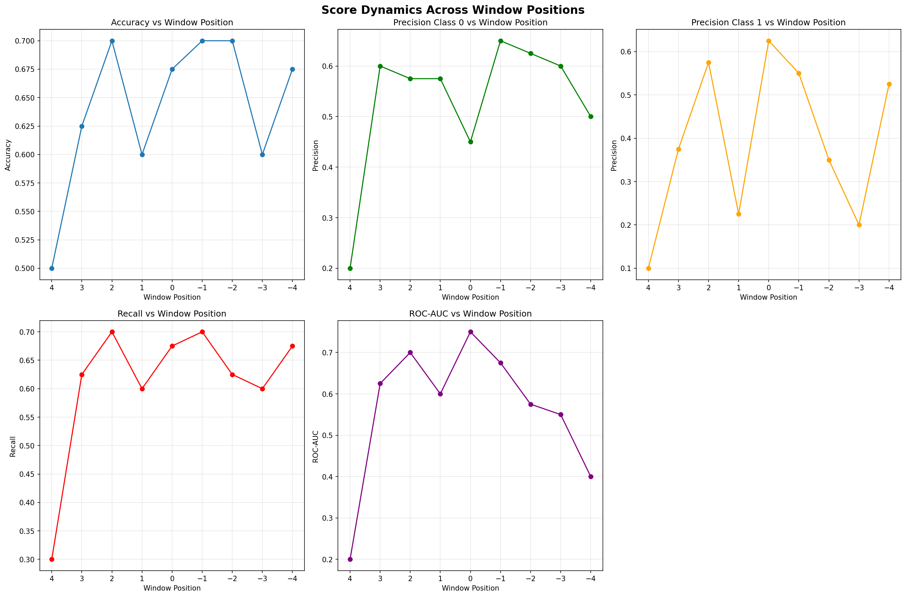
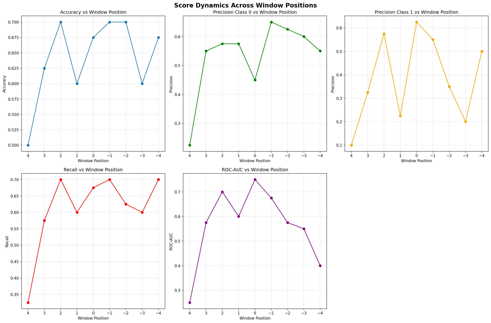
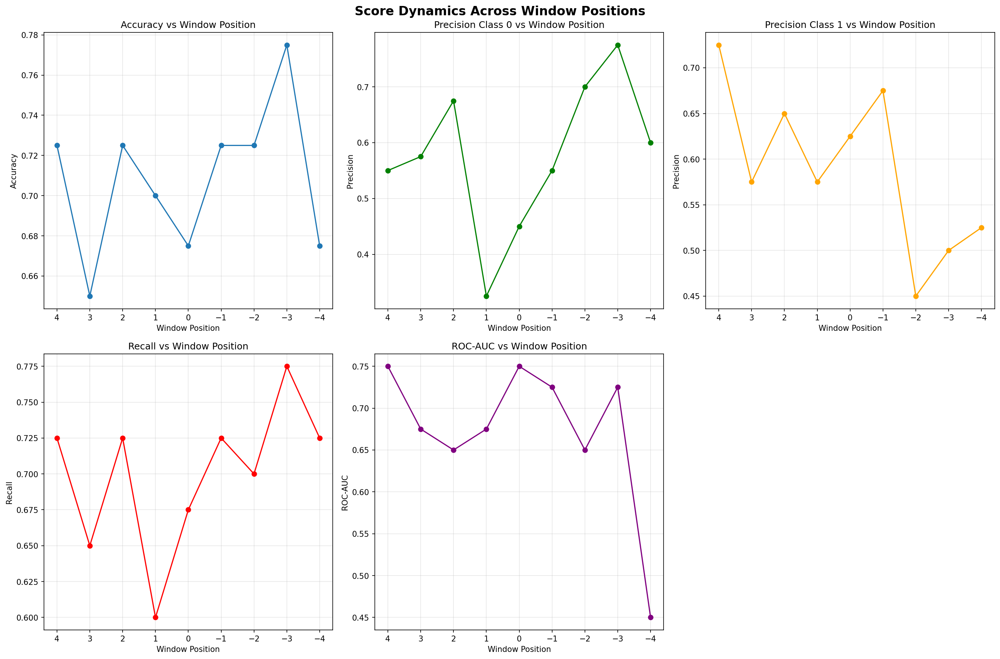
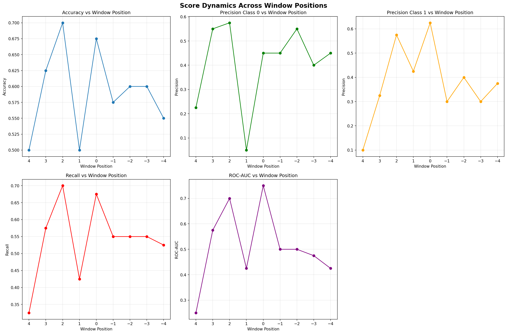
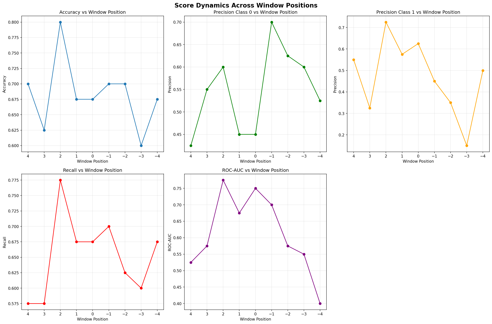

## Анализ разделимости скользящих окон

**Список событий:**

| rat_id | date |
|----------|----------|
| R2 | 2022-11-07 |
| R2 | 2022-11-18 |
| R2 | 2023-04-03 |
| R2 | 2023-04-11 |
| R2 | 2023-04-18 |
| R2 | 2023-04-21 |
| R2 | 2023-05-03 |
| R2 | 2023-05-09 |
| R2 | 2024-09-30 |
| R2 | 2024-10-29 |
| R3 | 2025-01-23 |
| R3 | 2025-03-14 |
| R1 | 2025-07-02 |
| R2 | 2025-07-02 |
| R3 | 2025-07-02 |
| R4 | 2025-07-02 |
| R1 | 2025-07-20 |
| R2 | 2025-07-20 |
| R3 | 2025-07-20 |
| R4 | 2025-07-20 |

**Структура пайплайна:**

```py
Pipeline steps:
  1. label_generator: CustomEventLabelGeneratorYt
  2. rem_calculator: REMProfileCalculatorYt
  3. sample_scaler: MaxMinSampleScaler
  4. feature_extractor: REMDailyMultiStatExtractorYt
  5. classifier: LogisticRegression
```
**Сетка гиперпараметров:**

| Параметр | Возможные значения |
|----------|-------------------|
| rem_calculator → window_size_hours | 2, 3 |
| feature_extractor → daily_statistics | ['max_min_diff', 'mean'], ['max_min_diff'], ['mean'] |
| classifier | DecisionTreeClassifier() |
| classifier → max_depth | 1, 2 |
| classifier → min_samples_split | 15 |


---

## Позиция сдвига относительно события 4 (аномальное окно: дни 6 to 4; контрольное окно: дни 8 to 5)


**Лучшие параметры:**

| Параметр | Значение |
|----------|----------|
| classifier | DecisionTreeClassifier() |
| classifier → max_depth | 2 |
| classifier → min_samples_split | 15 |
| feature_extractor → daily_statistics | ['mean'] |
| rem_calculator → window_size_hours | 2 |

**Результаты кросс-валидации:**

| Метрика | Значение |
|----------|----------|
| Accuracy | 0.5000 ± 0.2236 |
| Precision class 0 | 0.2000 ± 0.2449 |
| Precision class 1 | 0.1000 ± 0.2000 |
| Recall | 0.3000 ± 0.2449 |
| Roc-auc | 0.2000 ± 0.2449 |

```
В данном эксперименте в качестве контрольного (нормального) окна шириной 3 дня используются дни с 9 по 7 до сейсмического события, положение же целевого (аномального) окна в каждом эксперименте сдвигается на сутки вперед: от окна, совпадающего с контрольным, до окна с 6 по 8 день после события.

В кажом отчете представленны результаты 4-fold кросс-валидаци с проекциями пространства гиперпараметров в точке оптимума точности (Accuracy).

В конце отчета находится сводный график метрик разделимости данных подобранных моделей для разных окон со средними и отклонением по 4-м фолдам кросс-валидации.

В качестве признака используется размахи профиля на некотором разбиении вектора быстроволнового сна. Диаметр разбиения, а также ширина и шаг скользаящего окна для вычисления самого вектора являются гиперпараметрами и в каждом эксперементе различаются.

Для классификации используются простейшие модели: Логистическая регрессия и Метод опорных векторов с разными ядрами, решателями и прочими гиперпараметрами.
```


---

## Позиция сдвига относительно события 3 (аномальное окно: дни 5 to 3; контрольное окно: дни 8 to 5)


**Лучшие параметры:**

| Параметр | Значение |
|----------|----------|
| classifier | DecisionTreeClassifier() |
| classifier → max_depth | 1 |
| classifier → min_samples_split | 15 |
| feature_extractor → daily_statistics | ['max_min_diff', 'mean'] |
| rem_calculator → window_size_hours | 2 |

**Результаты кросс-валидации:**

| Метрика | Значение |
|----------|----------|
| Accuracy | 0.6250 ± 0.2681 |
| Precision class 0 | 0.6000 ± 0.3391 |
| Precision class 1 | 0.3750 ± 0.4710 |
| Recall | 0.6250 ± 0.3112 |
| Roc-auc | 0.6250 ± 0.3112 |


---

## Позиция сдвига относительно события 2 (аномальное окно: дни 4 to 2; контрольное окно: дни 8 to 5)


**Лучшие параметры:**

| Параметр | Значение |
|----------|----------|
| classifier | DecisionTreeClassifier() |
| classifier → max_depth | 2 |
| classifier → min_samples_split | 15 |
| feature_extractor → daily_statistics | ['mean'] |
| rem_calculator → window_size_hours | 2 |

**Результаты кросс-валидации:**

| Метрика | Значение |
|----------|----------|
| Accuracy | 0.7000 ± 0.2915 |
| Precision class 0 | 0.5750 ± 0.4265 |
| Precision class 1 | 0.5750 ± 0.4265 |
| Recall | 0.7000 ± 0.2915 |
| Roc-auc | 0.7000 ± 0.3317 |


---

## Позиция сдвига относительно события 1 (аномальное окно: дни 3 to 1; контрольное окно: дни 8 to 5)


**Лучшие параметры:**

| Параметр | Значение |
|----------|----------|
| classifier | DecisionTreeClassifier() |
| classifier → max_depth | 1 |
| classifier → min_samples_split | 15 |
| feature_extractor → daily_statistics | ['max_min_diff', 'mean'] |
| rem_calculator → window_size_hours | 3 |

**Результаты кросс-валидации:**

| Метрика | Значение |
|----------|----------|
| Accuracy | 0.6000 ± 0.2000 |
| Precision class 0 | 0.5750 ± 0.2385 |
| Precision class 1 | 0.2250 ± 0.4023 |
| Recall | 0.6000 ± 0.2000 |
| Roc-auc | 0.6000 ± 0.2000 |


---

## Позиция сдвига относительно события 0 (аномальное окно: дни 2 to 0; контрольное окно: дни 8 to 5)


**Лучшие параметры:**

| Параметр | Значение |
|----------|----------|
| classifier | DecisionTreeClassifier() |
| classifier → max_depth | 2 |
| classifier → min_samples_split | 15 |
| feature_extractor → daily_statistics | ['max_min_diff'] |
| rem_calculator → window_size_hours | 2 |

**Результаты кросс-валидации:**

| Метрика | Значение |
|----------|----------|
| Accuracy | 0.6750 ± 0.2861 |
| Precision class 0 | 0.4500 ± 0.4717 |
| Precision class 1 | 0.6250 ± 0.3491 |
| Recall | 0.6750 ± 0.2861 |
| Roc-auc | 0.7500 ± 0.3354 |


---

## Позиция сдвига относительно события -1 (аномальное окно: дни 1 to -1; контрольное окно: дни 8 to 5)


**Лучшие параметры:**

| Параметр | Значение |
|----------|----------|
| classifier | DecisionTreeClassifier() |
| classifier → max_depth | 2 |
| classifier → min_samples_split | 15 |
| feature_extractor → daily_statistics | ['max_min_diff'] |
| rem_calculator → window_size_hours | 3 |

**Результаты кросс-валидации:**

| Метрика | Значение |
|----------|----------|
| Accuracy | 0.7000 ± 0.2915 |
| Precision class 0 | 0.6500 ± 0.3905 |
| Precision class 1 | 0.5500 ± 0.4717 |
| Recall | 0.7000 ± 0.3317 |
| Roc-auc | 0.6750 ± 0.3961 |


---

## Позиция сдвига относительно события -2 (аномальное окно: дни 0 to -2; контрольное окно: дни 8 to 5)


**Лучшие параметры:**

| Параметр | Значение |
|----------|----------|
| classifier | DecisionTreeClassifier() |
| classifier → max_depth | 2 |
| classifier → min_samples_split | 15 |
| feature_extractor → daily_statistics | ['max_min_diff'] |
| rem_calculator → window_size_hours | 3 |

**Результаты кросс-валидации:**

| Метрика | Значение |
|----------|----------|
| Accuracy | 0.7000 ± 0.3317 |
| Precision class 0 | 0.6250 ± 0.3491 |
| Precision class 1 | 0.3500 ± 0.4770 |
| Recall | 0.6250 ± 0.3491 |
| Roc-auc | 0.5750 ± 0.3631 |


---

## Позиция сдвига относительно события -3 (аномальное окно: дни -1 to -3; контрольное окно: дни 8 to 5)


**Лучшие параметры:**

| Параметр | Значение |
|----------|----------|
| classifier | DecisionTreeClassifier() |
| classifier → max_depth | 1 |
| classifier → min_samples_split | 15 |
| feature_extractor → daily_statistics | ['max_min_diff'] |
| rem_calculator → window_size_hours | 3 |

**Результаты кросс-валидации:**

| Метрика | Значение |
|----------|----------|
| Accuracy | 0.6000 ± 0.2550 |
| Precision class 0 | 0.6000 ± 0.2550 |
| Precision class 1 | 0.2000 ± 0.4000 |
| Recall | 0.6000 ± 0.2550 |
| Roc-auc | 0.5500 ± 0.2693 |


---

## Позиция сдвига относительно события -4 (аномальное окно: дни -2 to -4; контрольное окно: дни 8 to 5)


**Лучшие параметры:**

| Параметр | Значение |
|----------|----------|
| classifier | DecisionTreeClassifier() |
| classifier → max_depth | 2 |
| classifier → min_samples_split | 15 |
| feature_extractor → daily_statistics | ['max_min_diff', 'mean'] |
| rem_calculator → window_size_hours | 3 |

**Результаты кросс-валидации:**

| Метрика | Значение |
|----------|----------|
| Accuracy | 0.6750 ± 0.3269 |
| Precision class 0 | 0.5000 ± 0.4743 |
| Precision class 1 | 0.5250 ± 0.4023 |
| Recall | 0.6750 ± 0.3269 |
| Roc-auc | 0.4000 ± 0.4637 |


---

## Динамика разделимости по метрикам

**Динамика метрик по позициям окна:**




---

## Позиция сдвига относительно события 4 (аномальное окно: дни 6 to 4; контрольное окно: дни 8 to 5)


**Лучшие параметры:**

| Параметр | Значение |
|----------|----------|
| classifier | DecisionTreeClassifier() |
| classifier → max_depth | 2 |
| classifier → min_samples_split | 9 |
| feature_extractor → daily_statistics | ['mean'] |
| rem_calculator → window_size_hours | 2 |

**Результаты кросс-валидации:**

| Метрика | Значение |
|----------|----------|
| Accuracy | 0.5000 ± 0.2236 |
| Precision class 0 | 0.2250 ± 0.2487 |
| Precision class 1 | 0.1000 ± 0.2000 |
| Recall | 0.3250 ± 0.2385 |
| Roc-auc | 0.2500 ± 0.2958 |

```
В данном эксперименте в качестве контрольного (нормального) окна шириной 3 дня используются дни с 9 по 7 до сейсмического события, положение же целевого (аномального) окна в каждом эксперименте сдвигается на сутки вперед: от окна, совпадающего с контрольным, до окна с 6 по 8 день после события.

В кажом отчете представленны результаты 4-fold кросс-валидаци с проекциями пространства гиперпараметров в точке оптимума точности (Accuracy).

В конце отчета находится сводный график метрик разделимости данных подобранных моделей для разных окон со средними и отклонением по 4-м фолдам кросс-валидации.

В качестве признака используется размахи профиля на некотором разбиении вектора быстроволнового сна. Диаметр разбиения, а также ширина и шаг скользаящего окна для вычисления самого вектора являются гиперпараметрами и в каждом эксперементе различаются.

Для классификации используются простейшие модели: Логистическая регрессия и Метод опорных векторов с разными ядрами, решателями и прочими гиперпараметрами.
```


---

## Позиция сдвига относительно события 3 (аномальное окно: дни 5 to 3; контрольное окно: дни 8 to 5)


**Лучшие параметры:**

| Параметр | Значение |
|----------|----------|
| classifier | DecisionTreeClassifier() |
| classifier → max_depth | 1 |
| classifier → min_samples_split | 9 |
| feature_extractor → daily_statistics | ['max_min_diff', 'mean'] |
| rem_calculator → window_size_hours | 2 |

**Результаты кросс-валидации:**

| Метрика | Значение |
|----------|----------|
| Accuracy | 0.6250 ± 0.2681 |
| Precision class 0 | 0.5500 ± 0.3500 |
| Precision class 1 | 0.3250 ± 0.4548 |
| Recall | 0.5750 ± 0.3269 |
| Roc-auc | 0.5750 ± 0.3269 |


---

## Позиция сдвига относительно события 2 (аномальное окно: дни 4 to 2; контрольное окно: дни 8 to 5)


**Лучшие параметры:**

| Параметр | Значение |
|----------|----------|
| classifier | DecisionTreeClassifier() |
| classifier → max_depth | 2 |
| classifier → min_samples_split | 9 |
| feature_extractor → daily_statistics | ['mean'] |
| rem_calculator → window_size_hours | 2 |

**Результаты кросс-валидации:**

| Метрика | Значение |
|----------|----------|
| Accuracy | 0.7000 ± 0.2915 |
| Precision class 0 | 0.5750 ± 0.4265 |
| Precision class 1 | 0.5750 ± 0.4265 |
| Recall | 0.7000 ± 0.2915 |
| Roc-auc | 0.7000 ± 0.3317 |


---

## Позиция сдвига относительно события 1 (аномальное окно: дни 3 to 1; контрольное окно: дни 8 to 5)


**Лучшие параметры:**

| Параметр | Значение |
|----------|----------|
| classifier | DecisionTreeClassifier() |
| classifier → max_depth | 1 |
| classifier → min_samples_split | 9 |
| feature_extractor → daily_statistics | ['max_min_diff', 'mean'] |
| rem_calculator → window_size_hours | 3 |

**Результаты кросс-валидации:**

| Метрика | Значение |
|----------|----------|
| Accuracy | 0.6000 ± 0.2000 |
| Precision class 0 | 0.5750 ± 0.2385 |
| Precision class 1 | 0.2250 ± 0.4023 |
| Recall | 0.6000 ± 0.2000 |
| Roc-auc | 0.6000 ± 0.2000 |


---

## Позиция сдвига относительно события 0 (аномальное окно: дни 2 to 0; контрольное окно: дни 8 to 5)


**Лучшие параметры:**

| Параметр | Значение |
|----------|----------|
| classifier | DecisionTreeClassifier() |
| classifier → max_depth | 2 |
| classifier → min_samples_split | 9 |
| feature_extractor → daily_statistics | ['max_min_diff'] |
| rem_calculator → window_size_hours | 2 |

**Результаты кросс-валидации:**

| Метрика | Значение |
|----------|----------|
| Accuracy | 0.6750 ± 0.2861 |
| Precision class 0 | 0.4500 ± 0.4717 |
| Precision class 1 | 0.6250 ± 0.3491 |
| Recall | 0.6750 ± 0.2861 |
| Roc-auc | 0.7500 ± 0.3354 |


---

## Позиция сдвига относительно события -1 (аномальное окно: дни 1 to -1; контрольное окно: дни 8 to 5)


**Лучшие параметры:**

| Параметр | Значение |
|----------|----------|
| classifier | DecisionTreeClassifier() |
| classifier → max_depth | 2 |
| classifier → min_samples_split | 9 |
| feature_extractor → daily_statistics | ['max_min_diff'] |
| rem_calculator → window_size_hours | 3 |

**Результаты кросс-валидации:**

| Метрика | Значение |
|----------|----------|
| Accuracy | 0.7000 ± 0.2915 |
| Precision class 0 | 0.6500 ± 0.3905 |
| Precision class 1 | 0.5500 ± 0.4717 |
| Recall | 0.7000 ± 0.3317 |
| Roc-auc | 0.6750 ± 0.3961 |


---

## Позиция сдвига относительно события -2 (аномальное окно: дни 0 to -2; контрольное окно: дни 8 to 5)


**Лучшие параметры:**

| Параметр | Значение |
|----------|----------|
| classifier | DecisionTreeClassifier() |
| classifier → max_depth | 2 |
| classifier → min_samples_split | 9 |
| feature_extractor → daily_statistics | ['max_min_diff'] |
| rem_calculator → window_size_hours | 3 |

**Результаты кросс-валидации:**

| Метрика | Значение |
|----------|----------|
| Accuracy | 0.7000 ± 0.3317 |
| Precision class 0 | 0.6250 ± 0.3491 |
| Precision class 1 | 0.3500 ± 0.4770 |
| Recall | 0.6250 ± 0.3491 |
| Roc-auc | 0.5750 ± 0.3631 |


---

## Позиция сдвига относительно события -3 (аномальное окно: дни -1 to -3; контрольное окно: дни 8 to 5)


**Лучшие параметры:**

| Параметр | Значение |
|----------|----------|
| classifier | DecisionTreeClassifier() |
| classifier → max_depth | 1 |
| classifier → min_samples_split | 9 |
| feature_extractor → daily_statistics | ['max_min_diff'] |
| rem_calculator → window_size_hours | 3 |

**Результаты кросс-валидации:**

| Метрика | Значение |
|----------|----------|
| Accuracy | 0.6000 ± 0.2550 |
| Precision class 0 | 0.6000 ± 0.2550 |
| Precision class 1 | 0.2000 ± 0.4000 |
| Recall | 0.6000 ± 0.2550 |
| Roc-auc | 0.5500 ± 0.2693 |


---

## Позиция сдвига относительно события -4 (аномальное окно: дни -2 to -4; контрольное окно: дни 8 to 5)


**Лучшие параметры:**

| Параметр | Значение |
|----------|----------|
| classifier | DecisionTreeClassifier() |
| classifier → max_depth | 2 |
| classifier → min_samples_split | 9 |
| feature_extractor → daily_statistics | ['max_min_diff'] |
| rem_calculator → window_size_hours | 3 |

**Результаты кросс-валидации:**

| Метрика | Значение |
|----------|----------|
| Accuracy | 0.6750 ± 0.3631 |
| Precision class 0 | 0.5500 ± 0.4444 |
| Precision class 1 | 0.5000 ± 0.4183 |
| Recall | 0.7000 ± 0.2915 |
| Roc-auc | 0.4000 ± 0.4637 |


---

## Динамика разделимости по метрикам

**Динамика метрик по позициям окна:**




---

## Позиция сдвига относительно события 4 (аномальное окно: дни 6 to 4; контрольное окно: дни 8 to 5)


**Лучшие параметры:**

| Параметр | Значение |
|----------|----------|
| classifier | DecisionTreeClassifier() |
| classifier → max_depth | 2 |
| classifier → min_samples_split | 9 |
| feature_extractor → daily_statistics | ['max_min_diff'] |
| rem_calculator → step_size_hours | 2 |
| rem_calculator → window_size_hours | 3 |

**Результаты кросс-валидации:**

| Метрика | Значение |
|----------|----------|
| Accuracy | 0.7250 ± 0.2947 |
| Precision class 0 | 0.5500 ± 0.4975 |
| Precision class 1 | 0.7250 ± 0.3345 |
| Recall | 0.7250 ± 0.3345 |
| Roc-auc | 0.7500 ± 0.3354 |

```
В данном эксперименте в качестве контрольного (нормального) окна шириной 3 дня используются дни с 9 по 7 до сейсмического события, положение же целевого (аномального) окна в каждом эксперименте сдвигается на сутки вперед: от окна, совпадающего с контрольным, до окна с 6 по 8 день после события.

В кажом отчете представленны результаты 4-fold кросс-валидаци с проекциями пространства гиперпараметров в точке оптимума точности (Accuracy).

В конце отчета находится сводный график метрик разделимости данных подобранных моделей для разных окон со средними и отклонением по 4-м фолдам кросс-валидации.

В качестве признака используется размахи профиля на некотором разбиении вектора быстроволнового сна. Диаметр разбиения, а также ширина и шаг скользаящего окна для вычисления самого вектора являются гиперпараметрами и в каждом эксперементе различаются.

Для классификации используются простейшие модели: Логистическая регрессия и Метод опорных векторов с разными ядрами, решателями и прочими гиперпараметрами.
```


---

## Позиция сдвига относительно события 3 (аномальное окно: дни 5 to 3; контрольное окно: дни 8 to 5)


**Лучшие параметры:**

| Параметр | Значение |
|----------|----------|
| classifier | DecisionTreeClassifier() |
| classifier → max_depth | 2 |
| classifier → min_samples_split | 9 |
| feature_extractor → daily_statistics | ['max_min_diff'] |
| rem_calculator → step_size_hours | 2 |
| rem_calculator → window_size_hours | 3 |

**Результаты кросс-валидации:**

| Метрика | Значение |
|----------|----------|
| Accuracy | 0.6500 ± 0.3571 |
| Precision class 0 | 0.5750 ± 0.4548 |
| Precision class 1 | 0.5750 ± 0.4548 |
| Recall | 0.6500 ± 0.3905 |
| Roc-auc | 0.6750 ± 0.3961 |


---

## Позиция сдвига относительно события 2 (аномальное окно: дни 4 to 2; контрольное окно: дни 8 to 5)


**Лучшие параметры:**

| Параметр | Значение |
|----------|----------|
| classifier | DecisionTreeClassifier() |
| classifier → max_depth | 2 |
| classifier → min_samples_split | 9 |
| feature_extractor → daily_statistics | ['max_min_diff', 'mean'] |
| rem_calculator → step_size_hours | 2 |
| rem_calculator → window_size_hours | 2 |

**Результаты кросс-валидации:**

| Метрика | Значение |
|----------|----------|
| Accuracy | 0.7250 ± 0.2487 |
| Precision class 0 | 0.6750 ± 0.4265 |
| Precision class 1 | 0.6500 ± 0.4500 |
| Recall | 0.7250 ± 0.3700 |
| Roc-auc | 0.6500 ± 0.4500 |


---

## Позиция сдвига относительно события 1 (аномальное окно: дни 3 to 1; контрольное окно: дни 8 to 5)


**Лучшие параметры:**

| Параметр | Значение |
|----------|----------|
| classifier | DecisionTreeClassifier() |
| classifier → max_depth | 2 |
| classifier → min_samples_split | 9 |
| feature_extractor → daily_statistics | ['max_min_diff'] |
| rem_calculator → step_size_hours | 2 |
| rem_calculator → window_size_hours | 3 |

**Результаты кросс-валидации:**

| Метрика | Значение |
|----------|----------|
| Accuracy | 0.7000 ± 0.2915 |
| Precision class 0 | 0.3250 ± 0.4548 |
| Precision class 1 | 0.5750 ± 0.3269 |
| Recall | 0.6000 ± 0.3000 |
| Roc-auc | 0.6750 ± 0.3269 |


---

## Позиция сдвига относительно события 0 (аномальное окно: дни 2 to 0; контрольное окно: дни 8 to 5)


**Лучшие параметры:**

| Параметр | Значение |
|----------|----------|
| classifier | DecisionTreeClassifier() |
| classifier → max_depth | 2 |
| classifier → min_samples_split | 9 |
| feature_extractor → daily_statistics | ['max_min_diff'] |
| rem_calculator → step_size_hours | 1 |
| rem_calculator → window_size_hours | 2 |

**Результаты кросс-валидации:**

| Метрика | Значение |
|----------|----------|
| Accuracy | 0.6750 ± 0.2861 |
| Precision class 0 | 0.4500 ± 0.4717 |
| Precision class 1 | 0.6250 ± 0.3491 |
| Recall | 0.6750 ± 0.2861 |
| Roc-auc | 0.7500 ± 0.3354 |


---

## Позиция сдвига относительно события -1 (аномальное окно: дни 1 to -1; контрольное окно: дни 8 to 5)


**Лучшие параметры:**

| Параметр | Значение |
|----------|----------|
| classifier | DecisionTreeClassifier() |
| classifier → max_depth | 1 |
| classifier → min_samples_split | 9 |
| feature_extractor → daily_statistics | ['mean'] |
| rem_calculator → step_size_hours | 2 |
| rem_calculator → window_size_hours | 2 |

**Результаты кросс-валидации:**

| Метрика | Значение |
|----------|----------|
| Accuracy | 0.7250 ± 0.2487 |
| Precision class 0 | 0.5500 ± 0.4717 |
| Precision class 1 | 0.6750 ± 0.3631 |
| Recall | 0.7250 ± 0.2947 |
| Roc-auc | 0.7250 ± 0.2947 |


---

## Позиция сдвига относительно события -2 (аномальное окно: дни 0 to -2; контрольное окно: дни 8 to 5)


**Лучшие параметры:**

| Параметр | Значение |
|----------|----------|
| classifier | DecisionTreeClassifier() |
| classifier → max_depth | 1 |
| classifier → min_samples_split | 9 |
| feature_extractor → daily_statistics | ['max_min_diff', 'mean'] |
| rem_calculator → step_size_hours | 2 |
| rem_calculator → window_size_hours | 2 |

**Результаты кросс-валидации:**

| Метрика | Значение |
|----------|----------|
| Accuracy | 0.7250 ± 0.2947 |
| Precision class 0 | 0.7000 ± 0.3317 |
| Precision class 1 | 0.4500 ± 0.4975 |
| Recall | 0.7000 ± 0.3317 |
| Roc-auc | 0.6500 ± 0.3571 |


---

## Позиция сдвига относительно события -3 (аномальное окно: дни -1 to -3; контрольное окно: дни 8 to 5)


**Лучшие параметры:**

| Параметр | Значение |
|----------|----------|
| classifier | DecisionTreeClassifier() |
| classifier → max_depth | 1 |
| classifier → min_samples_split | 9 |
| feature_extractor → daily_statistics | ['max_min_diff', 'mean'] |
| rem_calculator → step_size_hours | 2 |
| rem_calculator → window_size_hours | 3 |

**Результаты кросс-валидации:**

| Метрика | Значение |
|----------|----------|
| Accuracy | 0.7750 ± 0.2487 |
| Precision class 0 | 0.7750 ± 0.2487 |
| Precision class 1 | 0.5000 ± 0.5000 |
| Recall | 0.7750 ± 0.2487 |
| Roc-auc | 0.7250 ± 0.2947 |


---

## Позиция сдвига относительно события -4 (аномальное окно: дни -2 to -4; контрольное окно: дни 8 to 5)


**Лучшие параметры:**

| Параметр | Значение |
|----------|----------|
| classifier | DecisionTreeClassifier() |
| classifier → max_depth | 2 |
| classifier → min_samples_split | 9 |
| feature_extractor → daily_statistics | ['max_min_diff'] |
| rem_calculator → step_size_hours | 1 |
| rem_calculator → window_size_hours | 3 |

**Результаты кросс-валидации:**

| Метрика | Значение |
|----------|----------|
| Accuracy | 0.6750 ± 0.3631 |
| Precision class 0 | 0.6000 ± 0.4359 |
| Precision class 1 | 0.5250 ± 0.4323 |
| Recall | 0.7250 ± 0.2947 |
| Roc-auc | 0.4500 ± 0.4717 |


---

## Динамика разделимости по метрикам

**Динамика метрик по позициям окна:**




---

## Позиция сдвига относительно события 4 (аномальное окно: дни 6 to 4; контрольное окно: дни 8 to 5)


**Лучшие параметры:**

| Параметр | Значение |
|----------|----------|
| classifier | DecisionTreeClassifier() |
| classifier → max_depth | 2 |
| classifier → min_samples_split | 9 |
| feature_extractor → daily_statistics | ['mean'] |
| rem_calculator → window_size_hours | 2 |

**Результаты кросс-валидации:**

| Метрика | Значение |
|----------|----------|
| Accuracy | 0.5000 ± 0.2236 |
| Precision class 0 | 0.2250 ± 0.2487 |
| Precision class 1 | 0.1000 ± 0.2000 |
| Recall | 0.3250 ± 0.2385 |
| Roc-auc | 0.2500 ± 0.2958 |

```
В данном эксперименте в качестве контрольного (нормального) окна шириной 3 дня используются дни с 9 по 7 до сейсмического события, положение же целевого (аномального) окна в каждом эксперименте сдвигается на сутки вперед: от окна, совпадающего с контрольным, до окна с 6 по 8 день после события.

В кажом отчете представленны результаты 4-fold кросс-валидаци с проекциями пространства гиперпараметров в точке оптимума точности (Accuracy).

В конце отчета находится сводный график метрик разделимости данных подобранных моделей для разных окон со средними и отклонением по 4-м фолдам кросс-валидации.

В качестве признака используется размахи профиля на некотором разбиении вектора быстроволнового сна. Диаметр разбиения, а также ширина и шаг скользаящего окна для вычисления самого вектора являются гиперпараметрами и в каждом эксперементе различаются.

Для классификации используются простейшие модели: Логистическая регрессия и Метод опорных векторов с разными ядрами, решателями и прочими гиперпараметрами.
```


---

## Позиция сдвига относительно события 3 (аномальное окно: дни 5 to 3; контрольное окно: дни 8 to 5)


**Лучшие параметры:**

| Параметр | Значение |
|----------|----------|
| classifier | DecisionTreeClassifier() |
| classifier → max_depth | 1 |
| classifier → min_samples_split | 9 |
| feature_extractor → daily_statistics | ['max_min_diff', 'mean'] |
| rem_calculator → window_size_hours | 2 |

**Результаты кросс-валидации:**

| Метрика | Значение |
|----------|----------|
| Accuracy | 0.6250 ± 0.2681 |
| Precision class 0 | 0.5500 ± 0.3500 |
| Precision class 1 | 0.3250 ± 0.4548 |
| Recall | 0.5750 ± 0.3269 |
| Roc-auc | 0.5750 ± 0.3269 |


---

## Позиция сдвига относительно события 2 (аномальное окно: дни 4 to 2; контрольное окно: дни 8 to 5)


**Лучшие параметры:**

| Параметр | Значение |
|----------|----------|
| classifier | DecisionTreeClassifier() |
| classifier → max_depth | 2 |
| classifier → min_samples_split | 9 |
| feature_extractor → daily_statistics | ['mean'] |
| rem_calculator → window_size_hours | 2 |

**Результаты кросс-валидации:**

| Метрика | Значение |
|----------|----------|
| Accuracy | 0.7000 ± 0.2915 |
| Precision class 0 | 0.5750 ± 0.4265 |
| Precision class 1 | 0.5750 ± 0.4265 |
| Recall | 0.7000 ± 0.2915 |
| Roc-auc | 0.7000 ± 0.3317 |


---

## Позиция сдвига относительно события 1 (аномальное окно: дни 3 to 1; контрольное окно: дни 8 to 5)


**Лучшие параметры:**

| Параметр | Значение |
|----------|----------|
| classifier | DecisionTreeClassifier() |
| classifier → max_depth | 1 |
| classifier → min_samples_split | 9 |
| feature_extractor → daily_statistics | ['mean'] |
| rem_calculator → window_size_hours | 2 |

**Результаты кросс-валидации:**

| Метрика | Значение |
|----------|----------|
| Accuracy | 0.5000 ± 0.1581 |
| Precision class 0 | 0.0500 ± 0.2179 |
| Precision class 1 | 0.4250 ± 0.2385 |
| Recall | 0.4250 ± 0.2385 |
| Roc-auc | 0.4250 ± 0.2385 |


---

## Позиция сдвига относительно события 0 (аномальное окно: дни 2 to 0; контрольное окно: дни 8 to 5)


**Лучшие параметры:**

| Параметр | Значение |
|----------|----------|
| classifier | DecisionTreeClassifier() |
| classifier → max_depth | 2 |
| classifier → min_samples_split | 9 |
| feature_extractor → daily_statistics | ['max_min_diff'] |
| rem_calculator → window_size_hours | 2 |

**Результаты кросс-валидации:**

| Метрика | Значение |
|----------|----------|
| Accuracy | 0.6750 ± 0.2861 |
| Precision class 0 | 0.4500 ± 0.4717 |
| Precision class 1 | 0.6250 ± 0.3491 |
| Recall | 0.6750 ± 0.2861 |
| Roc-auc | 0.7500 ± 0.3354 |


---

## Позиция сдвига относительно события -1 (аномальное окно: дни 1 to -1; контрольное окно: дни 8 to 5)


**Лучшие параметры:**

| Параметр | Значение |
|----------|----------|
| classifier | DecisionTreeClassifier() |
| classifier → max_depth | 2 |
| classifier → min_samples_split | 9 |
| feature_extractor → daily_statistics | ['mean'] |
| rem_calculator → window_size_hours | 2 |

**Результаты кросс-валидации:**

| Метрика | Значение |
|----------|----------|
| Accuracy | 0.5750 ± 0.2385 |
| Precision class 0 | 0.4500 ± 0.3500 |
| Precision class 1 | 0.3000 ± 0.4000 |
| Recall | 0.5500 ± 0.2693 |
| Roc-auc | 0.5000 ± 0.3162 |


---

## Позиция сдвига относительно события -2 (аномальное окно: дни 0 to -2; контрольное окно: дни 8 to 5)


**Лучшие параметры:**

| Параметр | Значение |
|----------|----------|
| classifier | DecisionTreeClassifier() |
| classifier → max_depth | 2 |
| classifier → min_samples_split | 9 |
| feature_extractor → daily_statistics | ['max_min_diff'] |
| rem_calculator → window_size_hours | 2 |

**Результаты кросс-валидации:**

| Метрика | Значение |
|----------|----------|
| Accuracy | 0.6000 ± 0.4062 |
| Precision class 0 | 0.5500 ± 0.4444 |
| Precision class 1 | 0.4000 ± 0.4899 |
| Recall | 0.5500 ± 0.4444 |
| Roc-auc | 0.5000 ± 0.4472 |


---

## Позиция сдвига относительно события -3 (аномальное окно: дни -1 to -3; контрольное окно: дни 8 to 5)


**Лучшие параметры:**

| Параметр | Значение |
|----------|----------|
| classifier | DecisionTreeClassifier() |
| classifier → max_depth | 2 |
| classifier → min_samples_split | 9 |
| feature_extractor → daily_statistics | ['max_min_diff', 'mean'] |
| rem_calculator → window_size_hours | 2 |

**Результаты кросс-валидации:**

| Метрика | Значение |
|----------|----------|
| Accuracy | 0.6000 ± 0.3000 |
| Precision class 0 | 0.4000 ± 0.3742 |
| Precision class 1 | 0.3000 ± 0.3674 |
| Recall | 0.5500 ± 0.2693 |
| Roc-auc | 0.4750 ± 0.3700 |


---

## Позиция сдвига относительно события -4 (аномальное окно: дни -2 to -4; контрольное окно: дни 8 to 5)


**Лучшие параметры:**

| Параметр | Значение |
|----------|----------|
| classifier | DecisionTreeClassifier() |
| classifier → max_depth | 2 |
| classifier → min_samples_split | 9 |
| feature_extractor → daily_statistics | ['max_min_diff'] |
| rem_calculator → window_size_hours | 2 |

**Результаты кросс-валидации:**

| Метрика | Значение |
|----------|----------|
| Accuracy | 0.5500 ± 0.2693 |
| Precision class 0 | 0.4500 ± 0.4153 |
| Precision class 1 | 0.3750 ± 0.4437 |
| Recall | 0.5250 ± 0.3700 |
| Roc-auc | 0.4250 ± 0.4265 |


---

## Динамика разделимости по метрикам

**Динамика метрик по позициям окна:**




---

## Позиция сдвига относительно события 4 (аномальное окно: дни 6 to 4; контрольное окно: дни 8 to 5)


**Лучшие параметры:**

| Параметр | Значение |
|----------|----------|
| classifier | DecisionTreeClassifier() |
| classifier → max_depth | 2 |
| classifier → min_samples_split | 9 |
| feature_extractor → daily_statistics | ['max_min_diff', 'mean'] |
| rem_calculator → window_size_hours | 6 |

**Результаты кросс-валидации:**

| Метрика | Значение |
|----------|----------|
| Accuracy | 0.7000 ± 0.2915 |
| Precision class 0 | 0.4250 ± 0.4815 |
| Precision class 1 | 0.5500 ± 0.4153 |
| Recall | 0.5750 ± 0.3961 |
| Roc-auc | 0.5250 ± 0.4323 |

```
В данном эксперименте в качестве контрольного (нормального) окна шириной 3 дня используются дни с 9 по 7 до сейсмического события, положение же целевого (аномального) окна в каждом эксперименте сдвигается на сутки вперед: от окна, совпадающего с контрольным, до окна с 6 по 8 день после события.

В кажом отчете представленны результаты 4-fold кросс-валидаци с проекциями пространства гиперпараметров в точке оптимума точности (Accuracy).

В конце отчета находится сводный график метрик разделимости данных подобранных моделей для разных окон со средними и отклонением по 4-м фолдам кросс-валидации.

В качестве признака используется размахи профиля на некотором разбиении вектора быстроволнового сна. Диаметр разбиения, а также ширина и шаг скользаящего окна для вычисления самого вектора являются гиперпараметрами и в каждом эксперементе различаются.

Для классификации используются простейшие модели: Логистическая регрессия и Метод опорных векторов с разными ядрами, решателями и прочими гиперпараметрами.
```


---

## Позиция сдвига относительно события 3 (аномальное окно: дни 5 to 3; контрольное окно: дни 8 to 5)


**Лучшие параметры:**

| Параметр | Значение |
|----------|----------|
| classifier | DecisionTreeClassifier() |
| classifier → max_depth | 1 |
| classifier → min_samples_split | 9 |
| feature_extractor → daily_statistics | ['max_min_diff', 'mean'] |
| rem_calculator → window_size_hours | 2 |

**Результаты кросс-валидации:**

| Метрика | Значение |
|----------|----------|
| Accuracy | 0.6250 ± 0.2681 |
| Precision class 0 | 0.5500 ± 0.3500 |
| Precision class 1 | 0.3250 ± 0.4548 |
| Recall | 0.5750 ± 0.3269 |
| Roc-auc | 0.5750 ± 0.3269 |


---

## Позиция сдвига относительно события 2 (аномальное окно: дни 4 to 2; контрольное окно: дни 8 to 5)


**Лучшие параметры:**

| Параметр | Значение |
|----------|----------|
| classifier | DecisionTreeClassifier() |
| classifier → max_depth | 2 |
| classifier → min_samples_split | 9 |
| feature_extractor → daily_statistics | ['max_min_diff', 'mean'] |
| rem_calculator → window_size_hours | 6 |

**Результаты кросс-валидации:**

| Метрика | Значение |
|----------|----------|
| Accuracy | 0.8000 ± 0.2449 |
| Precision class 0 | 0.6000 ± 0.4637 |
| Precision class 1 | 0.7250 ± 0.3345 |
| Recall | 0.7750 ± 0.2487 |
| Roc-auc | 0.7750 ± 0.2947 |


---

## Позиция сдвига относительно события 1 (аномальное окно: дни 3 to 1; контрольное окно: дни 8 to 5)


**Лучшие параметры:**

| Параметр | Значение |
|----------|----------|
| classifier | DecisionTreeClassifier() |
| classifier → max_depth | 1 |
| classifier → min_samples_split | 9 |
| feature_extractor → daily_statistics | ['mean'] |
| rem_calculator → window_size_hours | 6 |

**Результаты кросс-валидации:**

| Метрика | Значение |
|----------|----------|
| Accuracy | 0.6750 ± 0.2385 |
| Precision class 0 | 0.4500 ± 0.4444 |
| Precision class 1 | 0.5750 ± 0.3631 |
| Recall | 0.6750 ± 0.2385 |
| Roc-auc | 0.6750 ± 0.2385 |


---

## Позиция сдвига относительно события 0 (аномальное окно: дни 2 to 0; контрольное окно: дни 8 to 5)


**Лучшие параметры:**

| Параметр | Значение |
|----------|----------|
| classifier | DecisionTreeClassifier() |
| classifier → max_depth | 2 |
| classifier → min_samples_split | 9 |
| feature_extractor → daily_statistics | ['max_min_diff'] |
| rem_calculator → window_size_hours | 2 |

**Результаты кросс-валидации:**

| Метрика | Значение |
|----------|----------|
| Accuracy | 0.6750 ± 0.2861 |
| Precision class 0 | 0.4500 ± 0.4717 |
| Precision class 1 | 0.6250 ± 0.3491 |
| Recall | 0.6750 ± 0.2861 |
| Roc-auc | 0.7500 ± 0.3354 |


---

## Позиция сдвига относительно события -1 (аномальное окно: дни 1 to -1; контрольное окно: дни 8 to 5)


**Лучшие параметры:**

| Параметр | Значение |
|----------|----------|
| classifier | DecisionTreeClassifier() |
| classifier → max_depth | 1 |
| classifier → min_samples_split | 9 |
| feature_extractor → daily_statistics | ['max_min_diff', 'mean'] |
| rem_calculator → window_size_hours | 6 |

**Результаты кросс-валидации:**

| Метрика | Значение |
|----------|----------|
| Accuracy | 0.7000 ± 0.2449 |
| Precision class 0 | 0.7000 ± 0.2915 |
| Precision class 1 | 0.4500 ± 0.4975 |
| Recall | 0.7000 ± 0.2915 |
| Roc-auc | 0.7000 ± 0.2915 |


---

## Позиция сдвига относительно события -2 (аномальное окно: дни 0 to -2; контрольное окно: дни 8 to 5)


**Лучшие параметры:**

| Параметр | Значение |
|----------|----------|
| classifier | DecisionTreeClassifier() |
| classifier → max_depth | 2 |
| classifier → min_samples_split | 9 |
| feature_extractor → daily_statistics | ['max_min_diff'] |
| rem_calculator → window_size_hours | 3 |

**Результаты кросс-валидации:**

| Метрика | Значение |
|----------|----------|
| Accuracy | 0.7000 ± 0.3317 |
| Precision class 0 | 0.6250 ± 0.3491 |
| Precision class 1 | 0.3500 ± 0.4770 |
| Recall | 0.6250 ± 0.3491 |
| Roc-auc | 0.5750 ± 0.3631 |


---

## Позиция сдвига относительно события -3 (аномальное окно: дни -1 to -3; контрольное окно: дни 8 to 5)


**Лучшие параметры:**

| Параметр | Значение |
|----------|----------|
| classifier | DecisionTreeClassifier() |
| classifier → max_depth | 1 |
| classifier → min_samples_split | 9 |
| feature_extractor → daily_statistics | ['max_min_diff', 'mean'] |
| rem_calculator → window_size_hours | 6 |

**Результаты кросс-валидации:**

| Метрика | Значение |
|----------|----------|
| Accuracy | 0.6000 ± 0.2000 |
| Precision class 0 | 0.6000 ± 0.2000 |
| Precision class 1 | 0.1500 ± 0.3571 |
| Recall | 0.6000 ± 0.2000 |
| Roc-auc | 0.5500 ± 0.2179 |


---

## Позиция сдвига относительно события -4 (аномальное окно: дни -2 to -4; контрольное окно: дни 8 to 5)


**Лучшие параметры:**

| Параметр | Значение |
|----------|----------|
| classifier | DecisionTreeClassifier() |
| classifier → max_depth | 2 |
| classifier → min_samples_split | 9 |
| feature_extractor → daily_statistics | ['max_min_diff', 'mean'] |
| rem_calculator → window_size_hours | 3 |

**Результаты кросс-валидации:**

| Метрика | Значение |
|----------|----------|
| Accuracy | 0.6750 ± 0.3631 |
| Precision class 0 | 0.5250 ± 0.4603 |
| Precision class 1 | 0.5000 ± 0.4183 |
| Recall | 0.6750 ± 0.3269 |
| Roc-auc | 0.4000 ± 0.4637 |


---

## Динамика разделимости по метрикам

**Динамика метрик по позициям окна:**




---

