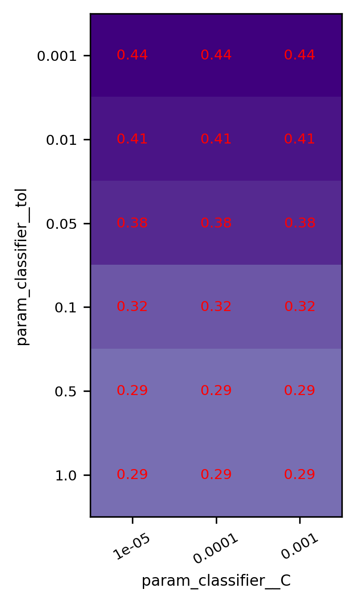
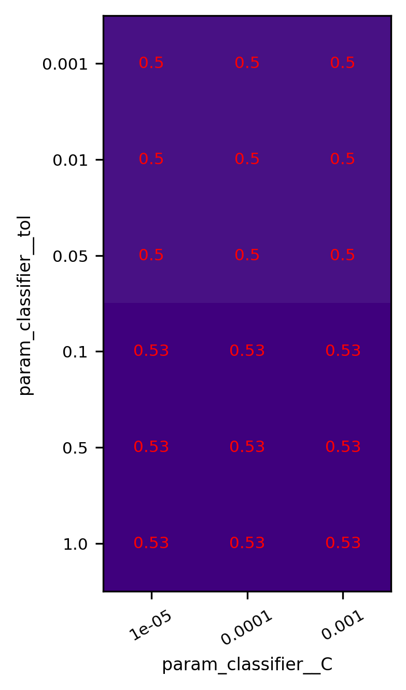
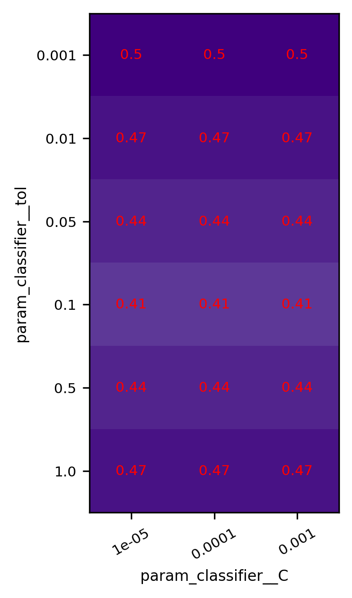
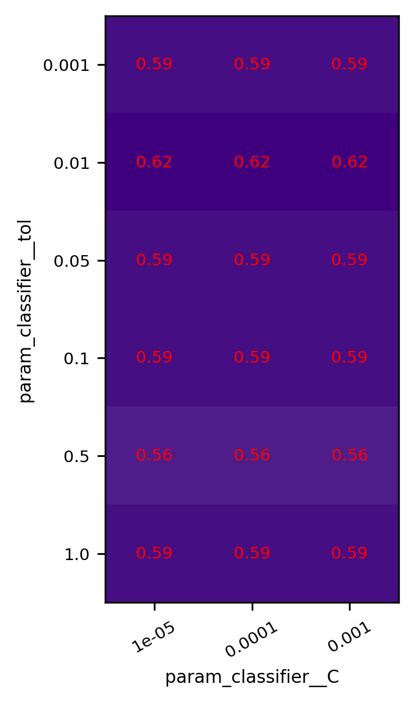
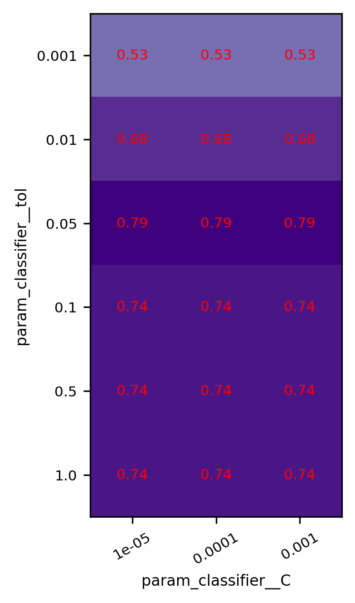
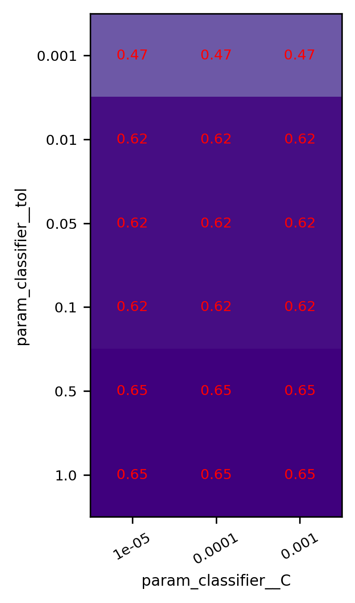
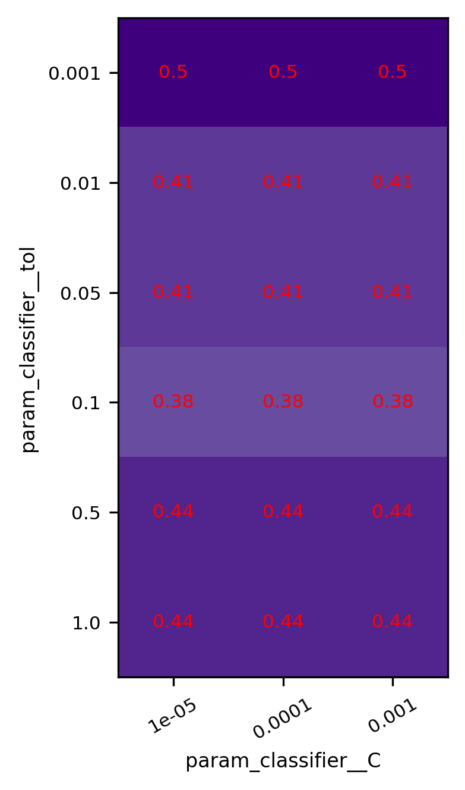
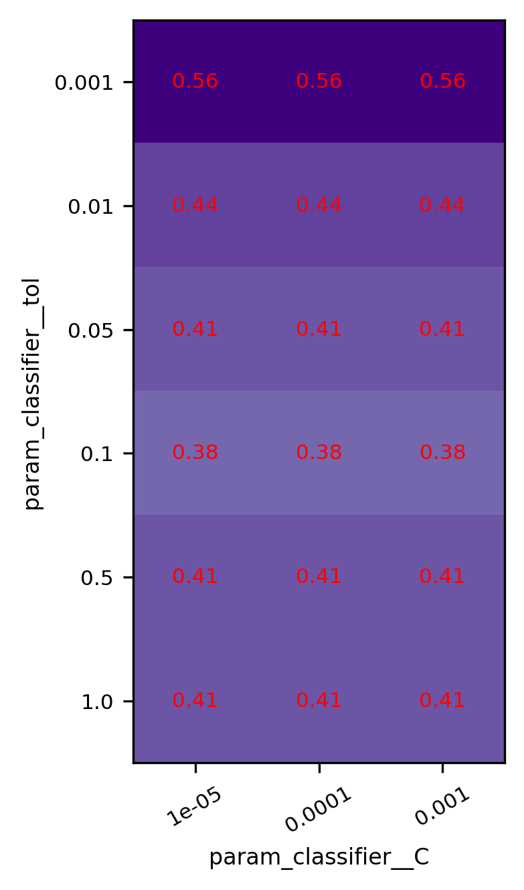
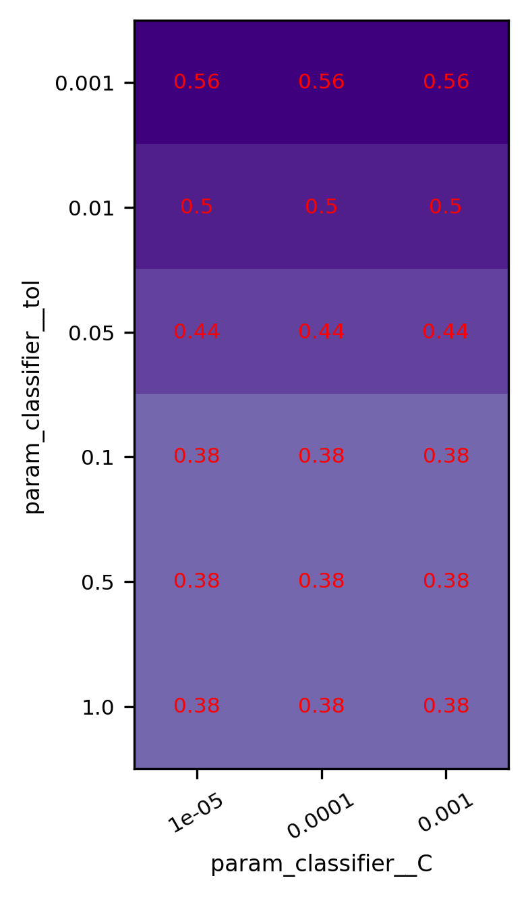
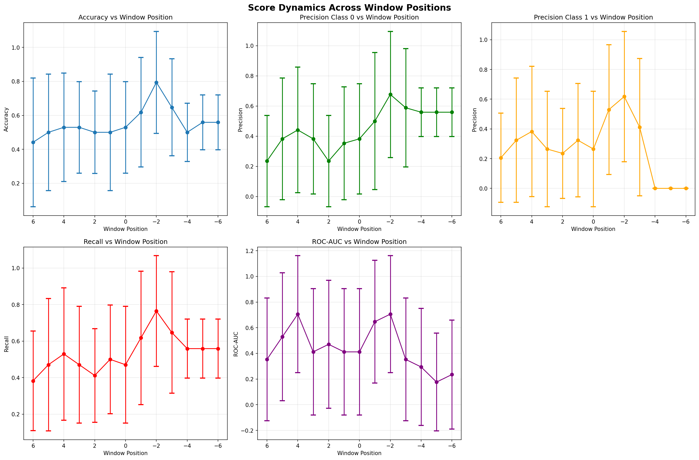

## Анализ разделимости скользящих окон

**Список событий:**

| rat_id | date |
|----------|----------|
| R2 | 2022-11-07 |
| R2 | 2023-04-03 |
| R2 | 2023-04-18 |
| R2 | 2023-04-21 |
| R2 | 2023-05-03 |
| R2 | 2024-09-30 |
| R2 | 2024-10-29 |
| R3 | 2025-01-23 |
| R3 | 2025-03-14 |
| R1 | 2025-07-02 |
| R2 | 2025-07-02 |
| R3 | 2025-07-02 |
| R4 | 2025-07-02 |
| R1 | 2025-07-20 |
| R2 | 2025-07-20 |
| R3 | 2025-07-20 |
| R4 | 2025-07-20 |

**Структура пайплайна:**

```py
Pipeline steps:
  1. label_generator: CustomEventLabelGeneratorYt
  2. rem_calculator: REMProfileCalculatorYt
  3. feature_extractor: REMDailyMultiStatExtractorYt
  4. classifier: LogisticRegression
```
**Сетка гиперпараметров:**

| Параметр | Возможные значения |
|----------|-------------------|
| classifier → C | 0.001, 0.01, 0.05, 0.1, 0.5, 1.0 |
| classifier → tol | 1e-05, 0.0001, 0.001 |


---

## Позиция сдвига относительно события 6 (аномальное окно: дни 8 to 6; контрольное окно: дни 9 to 7)



**Лучшие параметры:**

| Параметр | Значение |
|----------|----------|
| classifier → C | 0.001 |
| classifier → tol | 1e-05 |

**Результаты кросс-валидации:**

| Метрика | Значение |
|----------|----------|
| Accuracy | 0.4412 ± 0.3789 |
| Precision class 0 | 0.2353 ± 0.3028 |
| Precision class 1 | 0.2059 ± 0.2999 |
| Recall | 0.3824 ± 0.2728 |
| Roc-auc | 0.3529 ± 0.4779 |

```
В данном эксперименте в качестве контрольного (нормального) окна шириной 3 дня используются дни с 9 по 7 до сейсмического события, положение же целевого (аномального) окна в каждом эксперименте сдвигается на сутки вперед: от окна, совпадающего с контрольным, до окна с 6 по 8 день после события.

В кажом отчете представленны результаты 4-fold кросс-валидаци с проекциями пространства гиперпараметров в точке оптимума точности (Accuracy).

В конце отчета находится сводный график метрик разделимости данных подобранных моделей для разных окон со средними и отклонением по 4-м фолдам кросс-валидации.

В качестве признака используется размахи профиля на некотором разбиении вектора быстроволнового сна. Диаметр разбиения, а также ширина и шаг скользаящего окна для вычисления самого вектора являются гиперпараметрами и в каждом эксперементе различаются.

Для классификации используются простейшие модели: Логистическая регрессия и Метод опорных векторов с разными ядрами, решателями и прочими гиперпараметрами.
```


---

## Позиция сдвига относительно события 5 (аномальное окно: дни 7 to 5; контрольное окно: дни 9 to 7)


**Лучшие параметры:**

| Параметр | Значение |
|----------|----------|
| classifier → C | 0.01 |
| classifier → tol | 1e-05 |

**Результаты кросс-валидации:**

| Метрика | Значение |
|----------|----------|
| Accuracy | 0.5000 ± 0.3430 |
| Precision class 0 | 0.3824 ± 0.4033 |
| Precision class 1 | 0.3235 ± 0.4180 |
| Recall | 0.4706 ± 0.3626 |
| Roc-auc | 0.5294 ± 0.4991 |


---

## Позиция сдвига относительно события 4 (аномальное окно: дни 6 to 4; контрольное окно: дни 9 to 7)



**Лучшие параметры:**

| Параметр | Значение |
|----------|----------|
| classifier → C | 0.1 |
| classifier → tol | 1e-05 |

**Результаты кросс-валидации:**

| Метрика | Значение |
|----------|----------|
| Accuracy | 0.5294 ± 0.3195 |
| Precision class 0 | 0.4412 ± 0.4159 |
| Precision class 1 | 0.3824 ± 0.4382 |
| Recall | 0.5294 ± 0.3626 |
| Roc-auc | 0.7059 ± 0.4556 |


---

## Позиция сдвига относительно события 3 (аномальное окно: дни 5 to 3; контрольное окно: дни 9 to 7)


**Лучшие параметры:**

| Параметр | Значение |
|----------|----------|
| classifier → C | 0.001 |
| classifier → tol | 1e-05 |

**Результаты кросс-валидации:**

| Метрика | Значение |
|----------|----------|
| Accuracy | 0.5294 ± 0.2696 |
| Precision class 0 | 0.3824 ± 0.3650 |
| Precision class 1 | 0.2647 ± 0.3880 |
| Recall | 0.4706 ± 0.3195 |
| Roc-auc | 0.4118 ± 0.4922 |


---

## Позиция сдвига относительно события 2 (аномальное окно: дни 4 to 2; контрольное окно: дни 9 to 7)


**Лучшие параметры:**

| Параметр | Значение |
|----------|----------|
| classifier → C | 0.001 |
| classifier → tol | 1e-05 |

**Результаты кросс-валидации:**

| Метрика | Значение |
|----------|----------|
| Accuracy | 0.5000 ± 0.2425 |
| Precision class 0 | 0.2353 ± 0.3028 |
| Precision class 1 | 0.2353 ± 0.3028 |
| Recall | 0.4118 ± 0.2564 |
| Roc-auc | 0.4706 ± 0.4991 |


---

## Позиция сдвига относительно события 1 (аномальное окно: дни 3 to 1; контрольное окно: дни 9 to 7)



**Лучшие параметры:**

| Параметр | Значение |
|----------|----------|
| classifier → C | 0.001 |
| classifier → tol | 1e-05 |

**Результаты кросс-валидации:**

| Метрика | Значение |
|----------|----------|
| Accuracy | 0.5000 ± 0.3430 |
| Precision class 0 | 0.3529 ± 0.3744 |
| Precision class 1 | 0.3235 ± 0.3812 |
| Recall | 0.5000 ± 0.2970 |
| Roc-auc | 0.4118 ± 0.4922 |


---

## Позиция сдвига относительно события 0 (аномальное окно: дни 2 to 0; контрольное окно: дни 9 to 7)


**Лучшие параметры:**

| Параметр | Значение |
|----------|----------|
| classifier → C | 0.001 |
| classifier → tol | 1e-05 |

**Результаты кросс-валидации:**

| Метрика | Значение |
|----------|----------|
| Accuracy | 0.5294 ± 0.2696 |
| Precision class 0 | 0.3824 ± 0.3650 |
| Precision class 1 | 0.2647 ± 0.3880 |
| Recall | 0.4706 ± 0.3195 |
| Roc-auc | 0.4118 ± 0.4922 |


---

## Позиция сдвига относительно события -1 (аномальное окно: дни 1 to -1; контрольное окно: дни 9 to 7)



**Лучшие параметры:**

| Параметр | Значение |
|----------|----------|
| classifier → C | 0.01 |
| classifier → tol | 1e-05 |

**Результаты кросс-валидации:**

| Метрика | Значение |
|----------|----------|
| Accuracy | 0.6176 ± 0.3222 |
| Precision class 0 | 0.5000 ± 0.4537 |
| Precision class 1 | 0.5294 ± 0.4362 |
| Recall | 0.6176 ± 0.3650 |
| Roc-auc | 0.6471 ± 0.4779 |


---

## Позиция сдвига относительно события -2 (аномальное окно: дни 0 to -2; контрольное окно: дни 9 to 7)



**Лучшие параметры:**

| Параметр | Значение |
|----------|----------|
| classifier → C | 0.05 |
| classifier → tol | 1e-05 |

**Результаты кросс-валидации:**

| Метрика | Значение |
|----------|----------|
| Accuracy | 0.7941 ± 0.2999 |
| Precision class 0 | 0.6765 ± 0.4180 |
| Precision class 1 | 0.6176 ± 0.4382 |
| Recall | 0.7647 ± 0.3028 |
| Roc-auc | 0.7059 ± 0.4556 |


---

## Позиция сдвига относительно события -3 (аномальное окно: дни -1 to -3; контрольное окно: дни 9 to 7)



**Лучшие параметры:**

| Параметр | Значение |
|----------|----------|
| classifier → C | 0.5 |
| classifier → tol | 1e-05 |

**Результаты кросс-валидации:**

| Метрика | Значение |
|----------|----------|
| Accuracy | 0.6471 ± 0.2852 |
| Precision class 0 | 0.5882 ± 0.3924 |
| Precision class 1 | 0.4118 ± 0.4613 |
| Recall | 0.6471 ± 0.3328 |
| Roc-auc | 0.3529 ± 0.4779 |


---

## Позиция сдвига относительно события -4 (аномальное окно: дни -2 to -4; контрольное окно: дни 9 to 7)



**Лучшие параметры:**

| Параметр | Значение |
|----------|----------|
| classifier → C | 0.001 |
| classifier → tol | 1e-05 |

**Результаты кросс-валидации:**

| Метрика | Значение |
|----------|----------|
| Accuracy | 0.5000 ± 0.1715 |
| Precision class 0 | 0.5588 ± 0.1611 |
| Precision class 1 | 0.0000 ± 0.0000 |
| Recall | 0.5588 ± 0.1611 |
| Roc-auc | 0.2941 ± 0.4556 |


---

## Позиция сдвига относительно события -5 (аномальное окно: дни -3 to -5; контрольное окно: дни 9 to 7)



**Лучшие параметры:**

| Параметр | Значение |
|----------|----------|
| classifier → C | 0.001 |
| classifier → tol | 1e-05 |

**Результаты кросс-валидации:**

| Метрика | Значение |
|----------|----------|
| Accuracy | 0.5588 ± 0.1611 |
| Precision class 0 | 0.5588 ± 0.1611 |
| Precision class 1 | 0.0000 ± 0.0000 |
| Recall | 0.5588 ± 0.1611 |
| Roc-auc | 0.1765 ± 0.3812 |


---

## Позиция сдвига относительно события -6 (аномальное окно: дни -4 to -6; контрольное окно: дни 9 to 7)



**Лучшие параметры:**

| Параметр | Значение |
|----------|----------|
| classifier → C | 0.001 |
| classifier → tol | 1e-05 |

**Результаты кросс-валидации:**

| Метрика | Значение |
|----------|----------|
| Accuracy | 0.5588 ± 0.1611 |
| Precision class 0 | 0.5588 ± 0.1611 |
| Precision class 1 | 0.0000 ± 0.0000 |
| Recall | 0.5588 ± 0.1611 |
| Roc-auc | 0.2353 ± 0.4242 |


---

## Динамика разделимости по метрикам

**Динамика метрик по позициям окна:**




---

