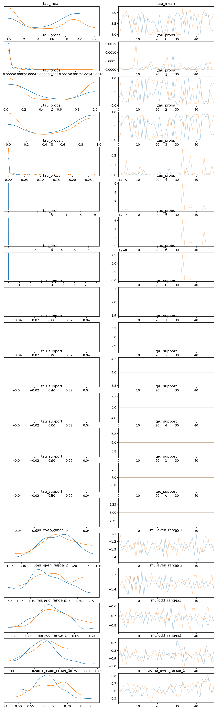
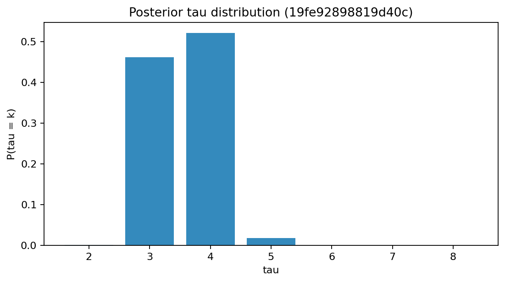
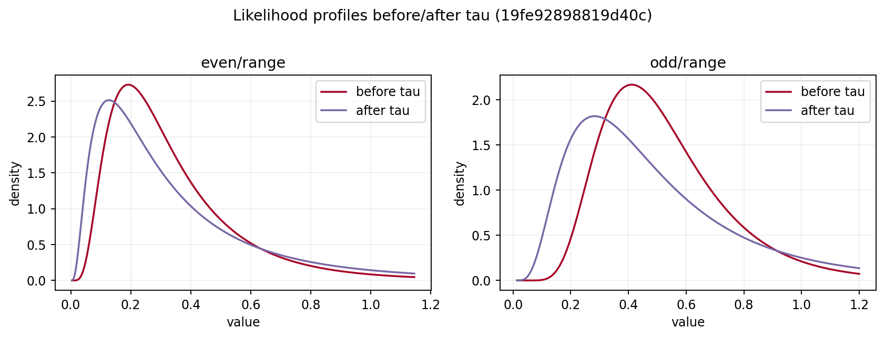
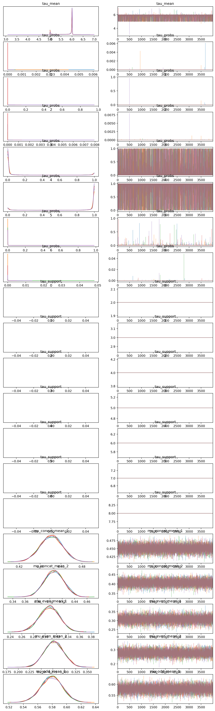
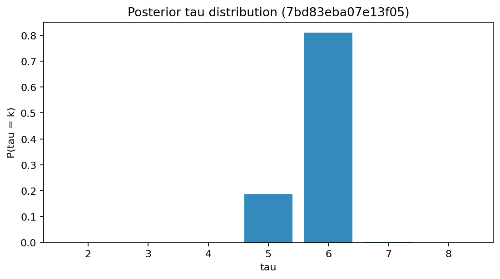
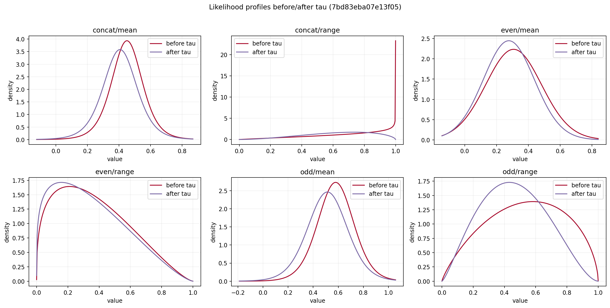

## Top-model rerun report (8-day exhaustive)

**Run setup:**

```
Reruns settings: draws=50, tune=50, chains=2, tau_mode=marginalized, tau range [2, 8]. Lists: top_loo, top_waic, top_mean_loo, top_p_tau.
```


---

## Comparative summary

**All unique rerun models:**

| fingerprint | shown_in | loo | waic | p_tau_gt_threshold | tau_MAP | r_hat_max | ess_min_bulk | influential_n_pareto_gt_0.7 |
|----------|----------|----------|----------|----------|----------|----------|----------|----------|
| 19fe92898819d40c | top_loo, top_waic | 25.070601332640603 | 10.160329009672175 | 8.70531702278504e-07 | 4 | 1.07 | 27.0 | 3 |


---

## Model 19fe92898819d40c

**Model details:**

```
Shown in: top_loo, top_waic
n_chunks: 16
feature_selection: {"even": ["range"], "odd": ["range"]}
parameter_selection: {"range": {"likelihood": "lognormal"}}
rem_profile_params: {"rem_stage": 2, "step_size_hours": 1, "window_size_hours": 2}
window_size_hours: 2
step_size_hours: 1
LOO: 25.0706
WAIC: 10.1603
P(tau > threshold): 8.70532e-07
tau_MAP: 4
r_hat_max: 1.07
ess_min_bulk: 27
ess_min_tail: 45
pareto_k_max: 1.7164
influential observations (k > 0.7): 3
trace_netcdf: /home/ponomattik/Work/Main project/run_output_8day/traces/19fe92898819d40c.nc

```


---

## Influential events for 19fe92898819d40c

**Pareto-k > 0.7:**

| event_observation_index | pareto_k | rat_id | event_date | window_direction |
|----------|----------|----------|----------|----------|
| 1 | 1.7164038133918278 | R2 | 2024-09-30 | before |
| 5 | 0.7546572169322054 | R2 | 2025-07-02 | before |
| 8 | 0.7069293177207321 | R1 | 2025-07-20 | before |


---

## Figure trace - 19fe92898819d40c

**trace (Shown in top_loo, top_waic):**




---

## Figure tau - 19fe92898819d40c

**tau (Shown in top_loo, top_waic):**




---

## Figure profiles - 19fe92898819d40c

**profiles (Shown in top_loo, top_waic):**




---

## Comparative summary

**All unique rerun models:**

| fingerprint | shown_in | loo | waic | p_tau_gt_threshold | tau_MAP | r_hat_max | ess_min_bulk | influential_n_pareto_gt_0.7 |
|----------|----------|----------|----------|----------|----------|----------|----------|----------|
| 19fe92898819d40c | top_loo, top_waic | 16.44615556812919 | 8.5969913078529 | 7.481769843420918e-05 | 4 | 1.0 | 19476.0 | 2 |
| 8e05f760f68711e3 | top_loo, top_waic | -10.852310390639492 | -28.953805130027646 | 4.298166160331351e-10 | 4 | 1.0 | 23207.0 | 1 |
| 446a60fa5456da9b | top_loo, top_waic | -19.615939434332574 | -29.510100537586624 | 0.0007851446151932516 | 4 | 1.0 | 19242.0 | 1 |
| 18617bd5ffd5f7ac | top_loo | 16.53086561144447 | 16.190846706247807 | 0.106463068976297 | 3 | 1.0 | 9490.0 | 1 |
| fcc42f2cf0b157eb | top_loo | -20.048230233908633 | -29.473123169704603 | 0.0007510012678296432 | 4 | 1.0 | 19384.0 | 1 |
| 0bbcca81e0c63a78 | top_waic | -9.235617475440563 | -27.052145804314097 | 7.890090232469961e-10 | 4 | 1.0 | 25326.0 | 1 |
| 1daa9f5ddb69a4df | top_waic | -8.272194720350923 | -29.1884333169814 | 1.02894942629667e-09 | 4 | 1.0 | 23462.0 | 2 |
| 6dbb590a8bf512d3 | top_mean_loo | 56.17899907841339 | 35.95242973222154 | 2.9251084499915e-10 | 4 | 1.0 | 16681.0 | 1 |
| 67bc1db938bb8b88 | top_mean_loo | 75.36555896709395 | 68.39078890683085 | 0.0002115441925307039 | 4 | 1.0 | 16077.0 | 2 |
| 074da89906d99b74 | top_mean_loo | 55.05606232029386 | 35.95487403979247 | 3.79134534628694e-10 | 4 | 1.0 | 19988.0 | 2 |
| 560bafec0f62b133 | top_mean_loo | 80.50079150020751 | 72.56496372480575 | 8.969897850237324e-05 | 4 | 1.0 | 11970.0 | 2 |
| efe3570810efd3e9 | top_mean_loo | 45.77669235234816 | 36.203201661782856 | 0.00011211413635083934 | 4 | 1.0 | 16501.0 | 2 |
| 6ce20266fe185d3b | top_p_tau | 94.44298381419176 | 97.23915408884112 | 0.09537550156103193 | 5 | 1.0 | 15490.0 | 2 |
| c8dbad95ffca951b | top_p_tau | 151.50994830398008 | 158.81675883525878 | 0.2594000938251601 | 5 | 1.0 | 12268.0 | 2 |
| 0b80d2435865009d | top_p_tau | 277.8263357618581 | 274.24207624667724 | 0.5466466979468899 | 6 | 1.0 | 11373.0 | 2 |
| f26b67eec9d05813 | top_p_tau | 324.7223783486991 | 314.43001413098517 | 0.6544849883064848 | 6 | 1.0 | 8899.0 | 3 |
| 7bd83eba07e13f05 | top_p_tau | 333.53611033276667 | 330.0559800038592 | 0.8128660242688326 | 6 | 1.0 | 11589.0 | 2 |


---

## Model 19fe92898819d40c

**Model details:**

```
Shown in: top_loo, top_waic
n_chunks: 16
feature_selection: {"even": ["range"], "odd": ["range"]}
parameter_selection: {"range": {"likelihood": "lognormal"}}
rem_profile_params: {"rem_stage": 2, "step_size_hours": 1, "window_size_hours": 2}
window_size_hours: 2
step_size_hours: 1
LOO: 16.4462
WAIC: 8.59699
P(tau > threshold): 7.48177e-05
tau_MAP: 4
r_hat_max: 1
ess_min_bulk: 19476
ess_min_tail: 13846
pareto_k_max: 1.99284
influential observations (k > 0.7): 2
trace_netcdf: /home/ponomattik/Work/Main project/run_output_8day/traces/19fe92898819d40c.nc

```


---

## Influential events for 19fe92898819d40c

**Pareto-k > 0.7:**

| event_observation_index | pareto_k | rat_id | event_date | window_direction |
|----------|----------|----------|----------|----------|
| 0 | 0.7658758213813363 | R2 | 2022-11-07 | before |
| 1 | 1.9928424643170255 | R2 | 2024-09-30 | before |


---

## Model 8e05f760f68711e3

**Model details:**

```
Shown in: top_loo, top_waic
n_chunks: 16
feature_selection: {"concat": ["range"], "even": ["range"], "odd": ["range"]}
parameter_selection: {"range": {"likelihood": "lognormal"}}
rem_profile_params: {"rem_stage": 2, "step_size_hours": 1, "window_size_hours": 2}
window_size_hours: 2
step_size_hours: 1
LOO: -10.8523
WAIC: -28.9538
P(tau > threshold): 4.29817e-10
tau_MAP: 4
r_hat_max: 1
ess_min_bulk: 23207
ess_min_tail: 13177
pareto_k_max: 3.48895
influential observations (k > 0.7): 1
trace_netcdf: /home/ponomattik/Work/Main project/run_output_8day/traces/8e05f760f68711e3.nc

```


---

## Influential events for 8e05f760f68711e3

**Pareto-k > 0.7:**

| event_observation_index | pareto_k | rat_id | event_date | window_direction |
|----------|----------|----------|----------|----------|
| 1 | 3.488952118698124 | R2 | 2024-09-30 | before |


---

## Model 446a60fa5456da9b

**Model details:**

```
Shown in: top_loo, top_waic
n_chunks: 16
feature_selection: {"concat": ["range"], "even": ["range"]}
parameter_selection: {"range": {"likelihood": "lognormal"}}
rem_profile_params: {"rem_stage": 2, "step_size_hours": 1, "window_size_hours": 2}
window_size_hours: 2
step_size_hours: 1
LOO: -19.6159
WAIC: -29.5101
P(tau > threshold): 0.000785145
tau_MAP: 4
r_hat_max: 1
ess_min_bulk: 19242
ess_min_tail: 12294
pareto_k_max: 2.78783
influential observations (k > 0.7): 1
trace_netcdf: /home/ponomattik/Work/Main project/run_output_8day/traces/446a60fa5456da9b.nc

```


---

## Influential events for 446a60fa5456da9b

**Pareto-k > 0.7:**

| event_observation_index | pareto_k | rat_id | event_date | window_direction |
|----------|----------|----------|----------|----------|
| 1 | 2.787826470516159 | R2 | 2024-09-30 | before |


---

## Model 18617bd5ffd5f7ac

**Model details:**

```
Shown in: top_loo
n_chunks: 16
feature_selection: {"even": ["range"]}
parameter_selection: {"range": {"likelihood": "lognormal"}}
rem_profile_params: {"rem_stage": 2, "step_size_hours": 1, "window_size_hours": 2}
window_size_hours: 2
step_size_hours: 1
LOO: 16.5309
WAIC: 16.1908
P(tau > threshold): 0.106463
tau_MAP: 3
r_hat_max: 1
ess_min_bulk: 9490
ess_min_tail: 8016
pareto_k_max: 1.08343
influential observations (k > 0.7): 1
trace_netcdf: /home/ponomattik/Work/Main project/run_output_8day/traces/18617bd5ffd5f7ac.nc

```


---

## Influential events for 18617bd5ffd5f7ac

**Pareto-k > 0.7:**

| event_observation_index | pareto_k | rat_id | event_date | window_direction |
|----------|----------|----------|----------|----------|
| 1 | 1.0834306951162076 | R2 | 2024-09-30 | before |


---

## Model fcc42f2cf0b157eb

**Model details:**

```
Shown in: top_loo
n_chunks: 16
feature_selection: {"concat": ["range"], "even": ["range"]}
parameter_selection: {"range": {"likelihood": "lognormal"}}
rem_profile_params: {"rem_stage": 2, "step_size_hours": 1, "window_size_hours": 3}
window_size_hours: 3
step_size_hours: 1
LOO: -20.0482
WAIC: -29.4731
P(tau > threshold): 0.000751001
tau_MAP: 4
r_hat_max: 1
ess_min_bulk: 19384
ess_min_tail: 12907
pareto_k_max: 3.01847
influential observations (k > 0.7): 1
trace_netcdf: /home/ponomattik/Work/Main project/run_output_8day/traces/fcc42f2cf0b157eb.nc

```


---

## Influential events for fcc42f2cf0b157eb

**Pareto-k > 0.7:**

| event_observation_index | pareto_k | rat_id | event_date | window_direction |
|----------|----------|----------|----------|----------|
| 1 | 3.0184694899847395 | R2 | 2024-09-30 | before |


---

## Model 0bbcca81e0c63a78

**Model details:**

```
Shown in: top_waic
n_chunks: 16
feature_selection: {"concat": ["range"], "even": ["range"], "odd": ["range"]}
parameter_selection: {"range": {"likelihood": "lognormal"}}
rem_profile_params: {"rem_stage": 2, "step_size_hours": 2, "window_size_hours": 2}
window_size_hours: 2
step_size_hours: 2
LOO: -9.23562
WAIC: -27.0521
P(tau > threshold): 7.89009e-10
tau_MAP: 4
r_hat_max: 1
ess_min_bulk: 25326
ess_min_tail: 13699
pareto_k_max: 3.13633
influential observations (k > 0.7): 1
trace_netcdf: /home/ponomattik/Work/Main project/run_output_8day/traces/0bbcca81e0c63a78.nc

```


---

## Influential events for 0bbcca81e0c63a78

**Pareto-k > 0.7:**

| event_observation_index | pareto_k | rat_id | event_date | window_direction |
|----------|----------|----------|----------|----------|
| 1 | 3.1363259292982 | R2 | 2024-09-30 | before |


---

## Model 1daa9f5ddb69a4df

**Model details:**

```
Shown in: top_waic
n_chunks: 16
feature_selection: {"concat": ["range"], "even": ["range"], "odd": ["range"]}
parameter_selection: {"range": {"likelihood": "lognormal"}}
rem_profile_params: {"rem_stage": 2, "step_size_hours": 1, "window_size_hours": 3}
window_size_hours: 3
step_size_hours: 1
LOO: -8.27219
WAIC: -29.1884
P(tau > threshold): 1.02895e-09
tau_MAP: 4
r_hat_max: 1
ess_min_bulk: 23462
ess_min_tail: 13049
pareto_k_max: 3.12735
influential observations (k > 0.7): 2
trace_netcdf: /home/ponomattik/Work/Main project/run_output_8day/traces/1daa9f5ddb69a4df.nc

```


---

## Influential events for 1daa9f5ddb69a4df

**Pareto-k > 0.7:**

| event_observation_index | pareto_k | rat_id | event_date | window_direction |
|----------|----------|----------|----------|----------|
| 0 | 0.7054592138350918 | R2 | 2022-11-07 | before |
| 1 | 3.127353703773789 | R2 | 2024-09-30 | before |


---

## Model 6dbb590a8bf512d3

**Model details:**

```
Shown in: top_mean_loo
n_chunks: 16
feature_selection: {"concat": ["range"], "even": ["range"], "odd": ["mean", "range"]}
parameter_selection: {"mean": {"likelihood": "student_t"}, "range": {"likelihood": "lognormal"}}
rem_profile_params: {"rem_stage": 2, "step_size_hours": 1, "window_size_hours": 2}
window_size_hours: 2
step_size_hours: 1
LOO: 56.179
WAIC: 35.9524
P(tau > threshold): 2.92511e-10
tau_MAP: 4
r_hat_max: 1
ess_min_bulk: 16681
ess_min_tail: 13243
pareto_k_max: 3.30911
influential observations (k > 0.7): 1
trace_netcdf: /home/ponomattik/Work/Main project/run_output_8day/traces/6dbb590a8bf512d3.nc

```


---

## Influential events for 6dbb590a8bf512d3

**Pareto-k > 0.7:**

| event_observation_index | pareto_k | rat_id | event_date | window_direction |
|----------|----------|----------|----------|----------|
| 1 | 3.30911137471836 | R2 | 2024-09-30 | before |


---

## Model 67bc1db938bb8b88

**Model details:**

```
Shown in: top_mean_loo
n_chunks: 16
feature_selection: {"even": ["range"], "odd": ["mean", "range"]}
parameter_selection: {"mean": {"likelihood": "normal"}, "range": {"likelihood": "lognormal"}}
rem_profile_params: {"rem_stage": 2, "step_size_hours": 1, "window_size_hours": 2}
window_size_hours: 2
step_size_hours: 1
LOO: 75.3656
WAIC: 68.3908
P(tau > threshold): 0.000211544
tau_MAP: 4
r_hat_max: 1
ess_min_bulk: 16077
ess_min_tail: 13427
pareto_k_max: 2.76105
influential observations (k > 0.7): 2
trace_netcdf: /home/ponomattik/Work/Main project/run_output_8day/traces/67bc1db938bb8b88.nc

```


---

## Influential events for 67bc1db938bb8b88

**Pareto-k > 0.7:**

| event_observation_index | pareto_k | rat_id | event_date | window_direction |
|----------|----------|----------|----------|----------|
| 0 | 0.9073721338846472 | R2 | 2022-11-07 | before |
| 1 | 2.761045734092353 | R2 | 2024-09-30 | before |


---

## Model 074da89906d99b74

**Model details:**

```
Shown in: top_mean_loo
n_chunks: 16
feature_selection: {"concat": ["range"], "even": ["range"], "odd": ["mean", "range"]}
parameter_selection: {"mean": {"likelihood": "normal"}, "range": {"likelihood": "lognormal"}}
rem_profile_params: {"rem_stage": 2, "step_size_hours": 1, "window_size_hours": 2}
window_size_hours: 2
step_size_hours: 1
LOO: 55.0561
WAIC: 35.9549
P(tau > threshold): 3.79135e-10
tau_MAP: 4
r_hat_max: 1
ess_min_bulk: 19988
ess_min_tail: 13011
pareto_k_max: 3.08423
influential observations (k > 0.7): 2
trace_netcdf: /home/ponomattik/Work/Main project/run_output_8day/traces/074da89906d99b74.nc

```


---

## Influential events for 074da89906d99b74

**Pareto-k > 0.7:**

| event_observation_index | pareto_k | rat_id | event_date | window_direction |
|----------|----------|----------|----------|----------|
| 0 | 1.0167259797939894 | R2 | 2022-11-07 | before |
| 1 | 3.084234185732464 | R2 | 2024-09-30 | before |


---

## Model 560bafec0f62b133

**Model details:**

```
Shown in: top_mean_loo
n_chunks: 16
feature_selection: {"even": ["range"], "odd": ["mean", "range"]}
parameter_selection: {"mean": {"likelihood": "student_t"}, "range": {"likelihood": "lognormal"}}
rem_profile_params: {"rem_stage": 2, "step_size_hours": 1, "window_size_hours": 2}
window_size_hours: 2
step_size_hours: 1
LOO: 80.5008
WAIC: 72.565
P(tau > threshold): 8.9699e-05
tau_MAP: 4
r_hat_max: 1
ess_min_bulk: 11970
ess_min_tail: 13730
pareto_k_max: 2.43162
influential observations (k > 0.7): 2
trace_netcdf: /home/ponomattik/Work/Main project/run_output_8day/traces/560bafec0f62b133.nc

```


---

## Influential events for 560bafec0f62b133

**Pareto-k > 0.7:**

| event_observation_index | pareto_k | rat_id | event_date | window_direction |
|----------|----------|----------|----------|----------|
| 0 | 0.7824865464049212 | R2 | 2022-11-07 | before |
| 1 | 2.431622217708173 | R2 | 2024-09-30 | before |


---

## Model efe3570810efd3e9

**Model details:**

```
Shown in: top_mean_loo
n_chunks: 16
feature_selection: {"concat": ["range"], "even": ["range"], "odd": ["mean"]}
parameter_selection: {"mean": {"likelihood": "student_t"}, "range": {"likelihood": "lognormal"}}
rem_profile_params: {"rem_stage": 2, "step_size_hours": 1, "window_size_hours": 2}
window_size_hours: 2
step_size_hours: 1
LOO: 45.7767
WAIC: 36.2032
P(tau > threshold): 0.000112114
tau_MAP: 4
r_hat_max: 1
ess_min_bulk: 16501
ess_min_tail: 11724
pareto_k_max: 2.98558
influential observations (k > 0.7): 2
trace_netcdf: /home/ponomattik/Work/Main project/run_output_8day/traces/efe3570810efd3e9.nc

```


---

## Influential events for efe3570810efd3e9

**Pareto-k > 0.7:**

| event_observation_index | pareto_k | rat_id | event_date | window_direction |
|----------|----------|----------|----------|----------|
| 0 | 0.8077400174169476 | R2 | 2022-11-07 | before |
| 1 | 2.98558301666266 | R2 | 2024-09-30 | before |


---

## Model 6ce20266fe185d3b

**Model details:**

```
Shown in: top_p_tau
n_chunks: 16
feature_selection: {"concat": ["range"], "even": ["range"], "odd": ["range"]}
parameter_selection: {"range": {"likelihood": "beta"}}
rem_profile_params: {"rem_stage": 2, "step_size_hours": 2, "window_size_hours": 2}
window_size_hours: 2
step_size_hours: 2
LOO: 94.443
WAIC: 97.2392
P(tau > threshold): 0.0953755
tau_MAP: 5
r_hat_max: 1
ess_min_bulk: 15490
ess_min_tail: 12448
pareto_k_max: 1.28852
influential observations (k > 0.7): 2
trace_netcdf: /home/ponomattik/Work/Main project/run_output_8day/traces/6ce20266fe185d3b.nc

```


---

## Influential events for 6ce20266fe185d3b

**Pareto-k > 0.7:**

| event_observation_index | pareto_k | rat_id | event_date | window_direction |
|----------|----------|----------|----------|----------|
| 1 | 1.2885244416961217 | R2 | 2024-09-30 | before |
| 22 | 1.26257163632469 | R1 | 2025-07-20 | after_reversed |


---

## Model c8dbad95ffca951b

**Model details:**

```
Shown in: top_p_tau
n_chunks: 16
feature_selection: {"concat": ["range"], "even": ["mean", "range"], "odd": ["range"]}
parameter_selection: {"mean": {"likelihood": "normal"}, "range": {"likelihood": "beta"}}
rem_profile_params: {"rem_stage": 2, "step_size_hours": 2, "window_size_hours": 2}
window_size_hours: 2
step_size_hours: 2
LOO: 151.51
WAIC: 158.817
P(tau > threshold): 0.2594
tau_MAP: 5
r_hat_max: 1
ess_min_bulk: 12268
ess_min_tail: 13476
pareto_k_max: 1.31677
influential observations (k > 0.7): 2
trace_netcdf: /home/ponomattik/Work/Main project/run_output_8day/traces/c8dbad95ffca951b.nc

```


---

## Influential events for c8dbad95ffca951b

**Pareto-k > 0.7:**

| event_observation_index | pareto_k | rat_id | event_date | window_direction |
|----------|----------|----------|----------|----------|
| 1 | 1.1956293725357166 | R2 | 2024-09-30 | before |
| 22 | 1.3167660108376522 | R1 | 2025-07-20 | after_reversed |


---

## Model 0b80d2435865009d

**Model details:**

```
Shown in: top_p_tau
n_chunks: 16
feature_selection: {"concat": ["mean", "range"], "even": ["range"], "odd": ["mean", "range"]}
parameter_selection: {"mean": {"likelihood": "student_t"}, "range": {"likelihood": "beta"}}
rem_profile_params: {"rem_stage": 2, "step_size_hours": 2, "window_size_hours": 2}
window_size_hours: 2
step_size_hours: 2
LOO: 277.826
WAIC: 274.242
P(tau > threshold): 0.546647
tau_MAP: 6
r_hat_max: 1
ess_min_bulk: 11373
ess_min_tail: 13909
pareto_k_max: 1.64964
influential observations (k > 0.7): 2
trace_netcdf: /home/ponomattik/Work/Main project/run_output_8day/traces/0b80d2435865009d.nc

```


---

## Influential events for 0b80d2435865009d

**Pareto-k > 0.7:**

| event_observation_index | pareto_k | rat_id | event_date | window_direction |
|----------|----------|----------|----------|----------|
| 1 | 1.6496356281942106 | R2 | 2024-09-30 | before |
| 22 | 1.0244164053312657 | R1 | 2025-07-20 | after_reversed |


---

## Model f26b67eec9d05813

**Model details:**

```
Shown in: top_p_tau
n_chunks: 16
feature_selection: {"concat": ["mean", "range"], "even": ["mean", "range"], "odd": ["mean", "range"]}
parameter_selection: {"mean": {"likelihood": "normal"}, "range": {"likelihood": "beta"}}
rem_profile_params: {"rem_stage": 2, "step_size_hours": 2, "window_size_hours": 2}
window_size_hours: 2
step_size_hours: 2
LOO: 324.722
WAIC: 314.43
P(tau > threshold): 0.654485
tau_MAP: 6
r_hat_max: 1
ess_min_bulk: 8899
ess_min_tail: 12911
pareto_k_max: 1.88242
influential observations (k > 0.7): 3
trace_netcdf: /home/ponomattik/Work/Main project/run_output_8day/traces/f26b67eec9d05813.nc

```


---

## Influential events for f26b67eec9d05813

**Pareto-k > 0.7:**

| event_observation_index | pareto_k | rat_id | event_date | window_direction |
|----------|----------|----------|----------|----------|
| 1 | 1.8824206414972182 | R2 | 2024-09-30 | before |
| 14 | 0.734260815689765 | R2 | 2024-09-30 | after_reversed |
| 22 | 1.0827022408345068 | R1 | 2025-07-20 | after_reversed |


---

## Model 7bd83eba07e13f05

**Model details:**

```
Shown in: top_p_tau
n_chunks: 16
feature_selection: {"concat": ["mean", "range"], "even": ["mean", "range"], "odd": ["mean", "range"]}
parameter_selection: {"mean": {"likelihood": "student_t"}, "range": {"likelihood": "beta"}}
rem_profile_params: {"rem_stage": 2, "step_size_hours": 2, "window_size_hours": 2}
window_size_hours: 2
step_size_hours: 2
LOO: 333.536
WAIC: 330.056
P(tau > threshold): 0.812866
tau_MAP: 6
r_hat_max: 1
ess_min_bulk: 11589
ess_min_tail: 13156
pareto_k_max: 1.69399
influential observations (k > 0.7): 2
trace_netcdf: /home/ponomattik/Work/Main project/run_output_8day/traces/7bd83eba07e13f05.nc

```


---

## Influential events for 7bd83eba07e13f05

**Pareto-k > 0.7:**

| event_observation_index | pareto_k | rat_id | event_date | window_direction |
|----------|----------|----------|----------|----------|
| 1 | 1.6939850546292856 | R2 | 2024-09-30 | before |
| 22 | 1.0750476924369259 | R1 | 2025-07-20 | after_reversed |


---

## Figure trace - 7bd83eba07e13f05

**trace (Shown in top_p_tau):**




---

## Figure tau - 7bd83eba07e13f05

**tau (Shown in top_p_tau):**




---

## Figure profiles - 7bd83eba07e13f05

**profiles (Shown in top_p_tau):**




---

